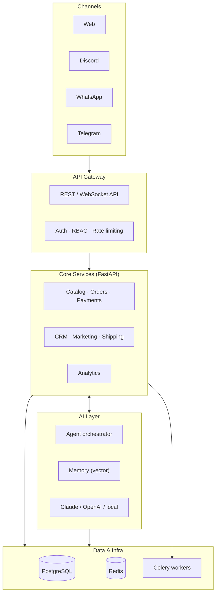
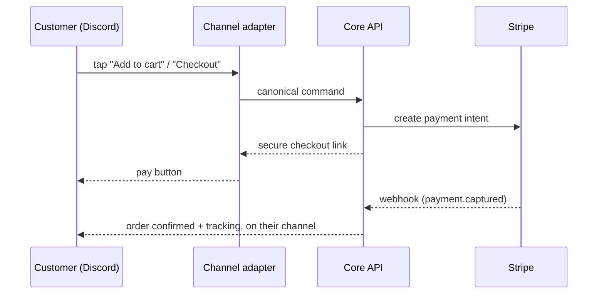

# Architecture

> A high-level map of how DLC OS fits together — start here, then dive into
> [`docs/04-architecture.md`](./docs/04-architecture.md) for the full detail.

DLC OS is an **AI-native commerce operating system**: one core that runs catalog,
checkout, customers, support, marketing, and analytics — exposed through **every
channel customers actually use** (web, Discord, WhatsApp, Telegram, …) and
orchestrated by an AI assistant that knows the business.

## The big picture

Every channel is a **thin adapter**; all business logic lives in the core. Adding
a new channel means adding one adapter — not a new application.

## Load-bearing design decisions

These are the choices everything else depends on. Change one and you redesign the
system. Each is documented in full in
[`docs/04-architecture.md`](./docs/04-architecture.md).

1. **One data model, many channels.** A customer, order, or product is the *same*
   record whether it arrived from the web or a Discord DM. Channels translate
   to/from **canonical commands** (`AddToCart`, `StartCheckout`) and hold no
   business logic.
   → [E-commerce](./docs/modules/02-ecommerce.md) · [CRM](./docs/modules/07-crm.md)

2. **Modular monolith first, services later.** One deployable FastAPI core with
   clean module boundaries. It splits into services only when scale demands it —
   the seams are drawn now so that split is never a rewrite.

3. **AI is a subsystem, not a bolt-on.** The assistant acts through the *same* API
   and the *same* RBAC as a human operator. It can read and *act*
   ("refund order #1203") only within the permissions of the user it acts for.
   → [AI architecture](./docs/10-ai-architecture.md)

4. **Never custody funds.** Money is held and moved by a licensed processor
   (**Stripe Connect** and equivalents); DLC OS orchestrates but never touches the
   float. This one decision keeps the marketplace legal without a
   money-transmitter license.
   → [Payments](./docs/modules/10-payments.md) · [Marketplace](./docs/modules/06-marketplace.md)

5. **Event-driven core.** Modules emit domain events (`order.placed`, `stock.low`,
   `payment.captured`) that analytics, marketing, and AI memory consume. The
   transactional core stays clean; insight and automation live downstream.
   → [Analytics](./docs/modules/12-analytics.md)

6. **Compliance is a feature, not a footnote.** WhatsApp opt-in + approved
   templates, PCI scope minimized via hosted checkout (cards never touch our
   servers), KYC/AML leaned onto the processor.
   → [Security](./docs/09-security-architecture.md)

## How a request flows (checkout on a chat channel)

The adapter only translates. The core owns the cart, the order, stock
reservation, and payment verification. Webhooks are signature-verified and
idempotent (deduped by event id).

## Where the code will live

DLC OS is a monorepo: a Python/FastAPI core, per-channel adapters, a Next.js
dashboard, and shared packages (UI, config, types). Full tree and conventions:
**[`docs/07-folder-structure.md`](./docs/07-folder-structure.md)**.

## Tech stack at a glance

| Layer | Technology |
|---|---|
| Backend | Python · FastAPI · PostgreSQL · Redis · Celery |
| Frontend | Next.js · React · TypeScript · Tailwind CSS |
| AI | Claude · OpenAI · local LLMs · vector memory · agent framework |
| Channels | Discord API · WhatsApp Business API · Telegram Bot API |
| Payments | Stripe (Connect) · PayPal · Square · crypto |

Rationale for each choice lives in
[`docs/04-architecture.md`](./docs/04-architecture.md).

## Go deeper

| Topic | Document |
|---|---|
| Full architecture & data flows | [docs/04-architecture.md](./docs/04-architecture.md) |
| Database schema | [docs/05-database-schema.md](./docs/05-database-schema.md) |
| API design | [docs/06-api-design.md](./docs/06-api-design.md) |
| AI architecture | [docs/10-ai-architecture.md](./docs/10-ai-architecture.md) |
| Security architecture | [docs/09-security-architecture.md](./docs/09-security-architecture.md) |
| All 12 modules | [docs/modules/](./docs/modules/) |

> **Status:** this describes the *target* architecture — the repo is in the
> `vision & architecture` stage. Track implementation in the
> [Development Roadmap](./docs/11-development-roadmap.md).
