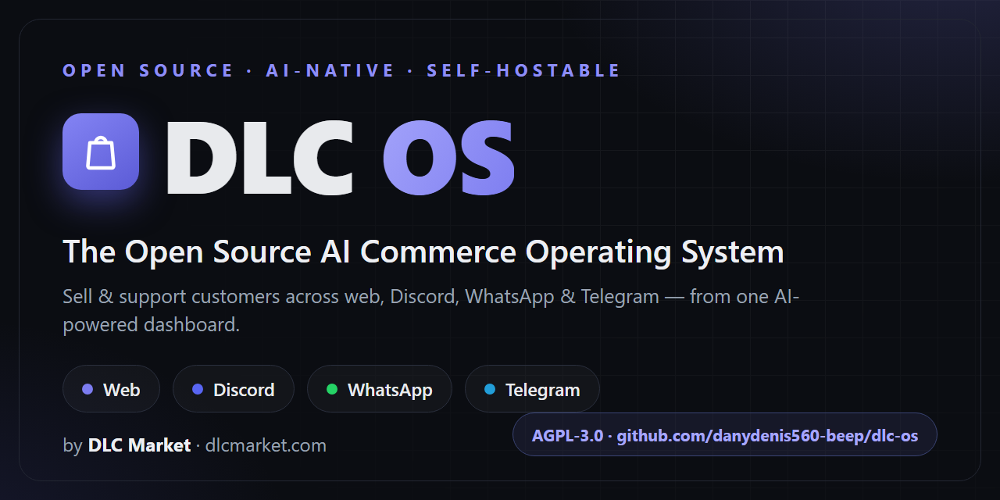
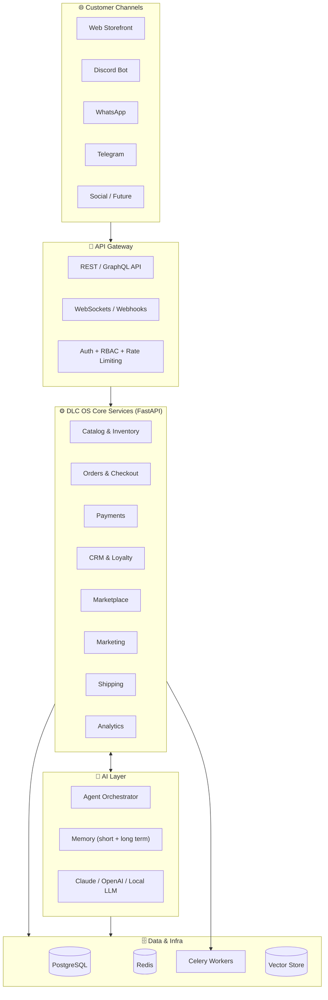

<div align="center">



**Sell products and manage customers across your website, Discord, WhatsApp, Telegram, and social media — from one AI-powered dashboard.**

_by **[DLC Market](https://dlcmarket.com)**_

[](./LICENSE)
[-orange.svg)](./docs/11-development-roadmap.md)
[](./CONTRIBUTING.md)
[](https://discord.gg/pSuq75c2)
[](./docs/README.md)

[**Vision**](./docs/01-product-vision.md) ·
[**Architecture**](./ARCHITECTURE.md) ·
[**Roadmap**](./ROADMAP.md) ·
[**Docs**](./docs/README.md) ·
[**Contribute**](./CONTRIBUTING.md)

</div>

---

> [!IMPORTANT]
> **DLC OS is in the `vision & architecture` stage.** This repository currently contains the complete product blueprint — the architecture, database schema, API design, roadmaps, and strategy that define what we're building and why. We are **building in public**. If the mission excites you, this is the best possible moment to get involved and shape the foundation. See [the roadmap](./ROADMAP.md) and [good first issues](./CONTRIBUTING.md#good-first-issues).

---

## 🌍 What is DLC OS?

Every business today is forced to stitch together a dozen disconnected tools: Shopify for the store, a hacky bot for Discord, a separate WhatsApp inbox, a CRM that never syncs, an email tool, an analytics dashboard nobody reads, and a spreadsheet holding it all together.

**DLC OS replaces that mess with one operating system.**

It is an open-source, AI-native commerce platform that lets a business run its **entire operation** — catalog, checkout, customers, support, marketing, and analytics — across **every channel customers actually use**, orchestrated by an AI assistant that knows your business.

Think **bigger than a store**. Think **operating system for commerce**.

| | Traditional Stack | DLC OS |
|---|---|---|
| **Channels** | Website only (bolt-ons for the rest) | Website + Discord + WhatsApp + Telegram + social, natively |
| **Intelligence** | Static dashboards | An AI assistant that sells, supports, forecasts & reports |
| **Architecture** | Closed SaaS silos | One open-source core, one data model, one API |
| **Ownership** | You rent it | You own it — self-host or cloud |
| **Cost** | $$$/mo + per-channel apps | Free & open source core |

---

## ✨ Core Modules

DLC OS is organized as twelve modules on a shared commerce core. Each links to its full specification.

| Module | What it does |
|---|---|
| 🤖 **[AI Assistant](./docs/modules/01-ai-assistant.md)** | Voice + text agent with long-term memory: sells, supports, recommends, forecasts, reports |
| 🛒 **[E-Commerce](./docs/modules/02-ecommerce.md)** | Catalog, variants, digital & physical products, cart, checkout, orders, returns |
| 💬 **[Discord Commerce](./docs/modules/03-discord-commerce.md)** | Browse, cart, checkout, tickets, reviews, vendor channels & affiliate program in Discord |
| 🟢 **[WhatsApp Commerce](./docs/modules/04-whatsapp-commerce.md)** | AI support, ordering, tracking, segmentation & broadcast campaigns over WhatsApp |
| ✈️ **[Telegram Commerce](./docs/modules/05-telegram-commerce.md)** | AI shopping assistant, catalog, checkout & support over Telegram |
| 🏪 **[Marketplace](./docs/modules/06-marketplace.md)** | Multi-vendor onboarding, verification, commissions, payouts, rankings |
| 👥 **[CRM](./docs/modules/07-crm.md)** | Unified customer profiles, history, segments, lifetime value, loyalty |
| 📦 **[Inventory](./docs/modules/08-inventory.md)** | Stock, warehouses, low-stock alerts, AI forecasting, barcode support |
| 🚚 **[Shipping](./docs/modules/09-shipping.md)** | Shipments, tracking, labels, carrier integrations, delivery estimates |
| 💳 **[Payments](./docs/modules/10-payments.md)** | Stripe, PayPal, Square, crypto & more — refunds, verification, fraud detection |
| 📣 **[Marketing](./docs/modules/11-marketing.md)** | Email, SMS, WhatsApp, push, referral & affiliate campaigns with AI suggestions |
| 📊 **[Analytics](./docs/modules/12-analytics.md)** | Revenue, customer, product, vendor & marketing analytics with AI-generated reports |

---

## 🏗️ Architecture at a glance



> Full diagrams, data flows, and service breakdown: **[docs/04-architecture.md](./docs/04-architecture.md)**

---

## 🧰 Tech Stack

| Layer | Technology |
|---|---|
| **Backend** | Python · FastAPI · PostgreSQL · Redis · Celery |
| **Frontend** | Next.js · React · TypeScript · Tailwind CSS |
| **AI** | Claude API · OpenAI API · Local LLM support · Vector memory · Agent framework |
| **Channels** | Discord API · WhatsApp Business API · Telegram Bot API |
| **Payments** | Stripe · PayPal · Square · Crypto |
| **Infra** | Docker · Kubernetes · GitHub Actions · CI/CD · Observability stack |

Rationale for every choice: **[docs/04-architecture.md](./docs/04-architecture.md)**

---

## 🚀 Getting Started

> [!NOTE]
> The codebase is being built in public. The commands below describe the **intended developer experience** — the one-command setup we are designing toward. Track implementation progress in the [Development Roadmap](./docs/11-development-roadmap.md).

```bash
# Clone
git clone https://github.com/danydenis560-beep/dlc-os.git
cd dlc-os

# Configure
cp .env.example .env   # add your API keys

# Run the whole stack (planned)
docker compose up
```

Right now, the most valuable thing you can do is **read the blueprint** and **shape the foundation**:

1. Start with the **[Product Vision](./docs/01-product-vision.md)**
2. Understand the **[Architecture](./docs/04-architecture.md)** and **[Database Schema](./docs/05-database-schema.md)**
3. See where we're going in the **[MVP Roadmap](./docs/12-mvp-roadmap.md)**
4. Pick something from **[Contributing](./CONTRIBUTING.md)**

---

## 📚 Documentation

The complete blueprint lives in **[`docs/`](./docs/README.md)**. Highlights:

| | |
|---|---|
| [📜 Product Vision](./docs/01-product-vision.md) | [📈 Market Analysis](./docs/02-market-analysis.md) |
| [⚔️ Competitive Analysis](./docs/03-competitive-analysis.md) | [🏛️ Architecture](./docs/04-architecture.md) |
| [🗄️ Database Schema](./docs/05-database-schema.md) | [🔌 API Design](./docs/06-api-design.md) |
| [📁 Folder Structure](./docs/07-folder-structure.md) | [🎨 UI/UX System](./docs/08-ui-ux-system.md) |
| [🔐 Security Architecture](./docs/09-security-architecture.md) | [🧠 AI Architecture](./docs/10-ai-architecture.md) |
| [🛣️ Development Roadmap](./docs/11-development-roadmap.md) | [🎯 MVP Roadmap](./docs/12-mvp-roadmap.md) |
| [🚀 Deployment Guide](./docs/15-deployment-guide.md) | [🌱 OSS Growth Strategy](./docs/16-open-source-growth-strategy.md) |
| [💰 Monetization Strategy](./docs/17-monetization-strategy.md) | [📊 Investor Pitch](./docs/18-investor-pitch.md) |

---

## 🤝 Contributing

DLC OS is built by its community. Whether you write Python, design interfaces, write docs, or run a business that lives on these problems — **there is a place for you here.**

- 📖 Read the **[Contributing Guide](./CONTRIBUTING.md)**
- 🤝 Follow our **[Code of Conduct](./CODE_OF_CONDUCT.md)**
- 🐛 Found a bug or have an idea? **[Open an issue](https://github.com/danydenis560-beep/dlc-os/issues/new/choose)**
- 🔐 Security concern? See **[SECURITY.md](./SECURITY.md)**

---

## 💬 Community

- **Discord** — [join the community](https://discord.gg/pSuq75c2) for chat, support, and roadmap discussions
- **GitHub Discussions** — proposals, Q&A, show & tell

> ⭐ **Star this repo** to follow along — it genuinely helps the project grow and signals demand to contributors.

---

## 📄 License

DLC OS is released under the **[GNU AGPL-3.0](./LICENSE)**. You can self-host, modify, and build on it freely; the AGPL's network-copyleft keeps improvements open. A separate **commercial license** is available for organizations that can't comply with the AGPL — see the [Monetization Strategy](./docs/17-monetization-strategy.md) for how this open-core model funds the project without ever closing the core.

---

<div align="center">

**Built in the open. Owned by everyone. Powered by AI.**

*DLC OS — The Open Source AI Commerce Operating System.*

</div>
