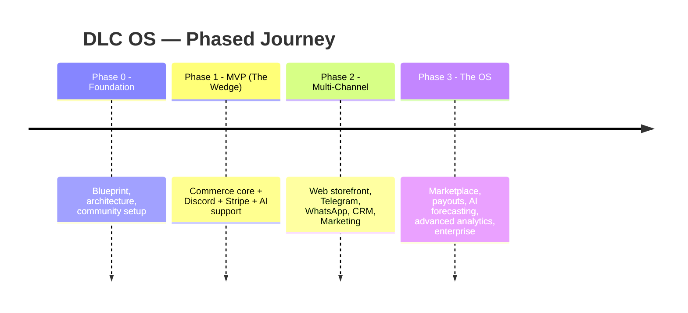

# DLC OS Roadmap

This is the high-level map. Detailed, dated breakdowns live in the docs:
[Development Roadmap](./docs/11-development-roadmap.md) ·
[MVP](./docs/12-mvp-roadmap.md) ·
[Phase 2](./docs/13-phase-2-roadmap.md) ·
[Phase 3](./docs/14-phase-3-roadmap.md).

> **Philosophy:** a bold North Star, shipped in disciplined phases. We win a
> focused wedge first, earn a community and real usage, then expand outward into
> the full operating system. Feature-completeness is the destination, not the
> starting line.

## 🧱 Phase 0 — Foundation *(now)*
- [x] Product vision & strategy
- [x] Architecture, schema, API design
- [x] Module specifications
- [x] GitHub repository & community files
- [ ] Project scaffolding (monorepo, CI, Docker)
- [ ] Core data models implemented

## 🎯 Phase 1 — MVP: The Wedge
**Goal: be the best way to sell on Discord, with real checkout and an AI that helps.**
- [ ] Commerce core: products, variants, inventory, cart, orders
- [ ] Stripe checkout + webhooks
- [ ] Discord commerce bot: browse, cart, checkout, order tracking, support tickets
- [ ] AI assistant: customer support + product recommendations with memory
- [ ] Admin dashboard: products, orders, customers
- [ ] One-command Docker setup + great docs

## 🌐 Phase 2 — Multi-Channel
**Goal: one catalog, every channel; a real CRM and marketing engine.**
- [ ] Web storefront (Next.js)
- [ ] Telegram commerce
- [ ] WhatsApp commerce (Business API)
- [ ] CRM: unified profiles, segments, lifetime value, loyalty
- [ ] Marketing: email, SMS, broadcasts, coupons, referrals
- [ ] Shipping integrations + analytics v1

## 🏪 Phase 3 — The Operating System
**Goal: the full multi-vendor, AI-run commerce OS.**
- [ ] Multi-vendor marketplace: onboarding, verification, commissions
- [ ] Payouts (Stripe Connect) + more payment rails
- [ ] AI inventory forecasting & marketing recommendations
- [ ] Advanced analytics & AI-generated reports
- [ ] Affiliate/referral at scale, vendor rankings
- [ ] Enterprise: SSO, audit, multi-region, plugin marketplace

See each phase's doc for scope, sequencing, dependencies, and the real-world
constraints (e.g. WhatsApp API approval, marketplace payout compliance) we plan around.
