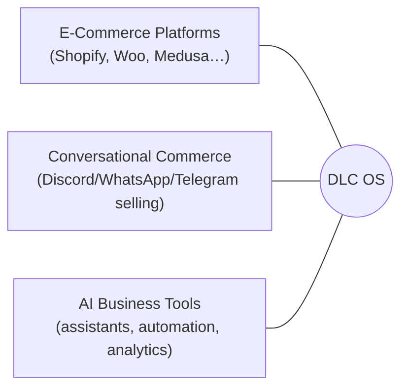

# 02 · Market Analysis

> A view of the market DLC OS plays in, why it's large, and why now is the moment.

## The market in one picture

DLC OS sits at the intersection of three large, growing markets:

Each alone is a multi-billion-dollar category. Their overlap — **AI-native,
omni-channel, open commerce infrastructure** — is largely unserved.

## Market sizing (directional)

> These are directional, public-knowledge estimates to frame opportunity — not
> audited figures. Replace with sourced numbers before any fundraising use.

| Layer | Scope | Order of magnitude |
|---|---|---|
| **TAM** — global commerce software & enablement | All software businesses use to sell online & manage operations | **Hundreds of $B/yr** |
| **SAM** — SMB + mid-market omni-channel commerce + creator/community commerce | Businesses needing multi-channel selling + AI + CRM | **Tens of $B/yr** |
| **SOM** — initial beachhead | Discord/Telegram-native & creator sellers + open-source-friendly SMBs in first 24–36 months | **$100M+/yr addressable** |

The shape that matters: a **massive TAM**, a **clear, underserved beachhead**
(community/chat-native commerce), and an **expansion path** through the rest of
the stack each business already pays for.

## Key trends powering DLC OS

1. **Conversational & community commerce is exploding.** Billions of people
   transact and discover products inside messaging and community apps. Discord,
   Telegram, and WhatsApp are becoming storefronts — but the tooling is primitive.
2. **AI has crossed the capability threshold.** LLMs can now genuinely sell,
   support, summarize, and forecast. "AI co-pilot for my business" went from demo
   to expectation.
3. **SaaS fatigue & rising fees.** Businesses are tired of stacking subscriptions
   and per-transaction fees. "Own your stack" resonates.
4. **Open-source is eating infrastructure.** Developers and businesses
   increasingly prefer open, self-hostable cores (see Medusa, Saleor, Supabase,
   Cal.com, Dub, Twenty). Open-source commerce is a proven, growing category.
5. **The creator economy needs real infrastructure.** Millions of creators and
   community operators sell digital and physical goods with duct-taped tools.

## Market segments & entry order

| Segment | Size of pain | Willingness to adopt OSS | Entry order |
|---|---|---|---|
| **Discord/Telegram-native sellers & communities** | Very high (no good tools) | High (technical, community-driven) | **1st (beachhead)** |
| **Creators / digital-product sellers** | High | High | 1st–2nd |
| **SMB physical-product sellers** | High (integration tax) | Medium | 2nd |
| **DTC / mid-market brands** | High (channel silos) | Medium | 2nd–3rd |
| **Marketplace operators** | High (no affordable infra) | Medium-High | 3rd |
| **Enterprise** | Medium (build vs buy) | Growing | 3rd+ |

## Why now

- The **tech is ready** (capable LLMs, mature async Python, great frontend tooling).
- The **channels are ready** (Discord/Telegram/WhatsApp all expose commerce-capable APIs).
- The **buyers are ready** (SaaS fatigue + AI expectation + open-source trust).
- **No one owns the intersection.** Incumbents are channel-blind; bots are
  toys; AI tools don't touch the commerce core. The gap is wide open.

## Risks & headwinds (and our answers)

| Risk | Reality | Our response |
|---|---|---|
| Platform/API dependence (Discord, Meta) | Real — APIs and policies change | Abstraction layer + multi-channel so no single platform is fatal |
| WhatsApp/Meta approval gates | Real — Business API needs verification | Sequenced into Phase 2 with compliance built in |
| Money movement & payouts regulation | Real — marketplace payouts = money transmission | Use Stripe Connect/PayPal; never custody funds ourselves |
| Incumbents add AI/channels | Likely | We're open, owned, and channel-native by design — hard to copy without cannibalizing their model |
| OSS monetization is hard | True | Clear open-core + cloud strategy (see [Monetization](./17-monetization-strategy.md)) |

## Takeaway

A very large market, a sharp and underserved beachhead, strong tailwinds, and a
defensible expansion path. The strategy is not "out-feature Shopify on day one" —
it is to **own the channel commerce + AI wedge**, then expand across the stack
every business already pays for.

Next: [Competitive Analysis](./03-competitive-analysis.md)
