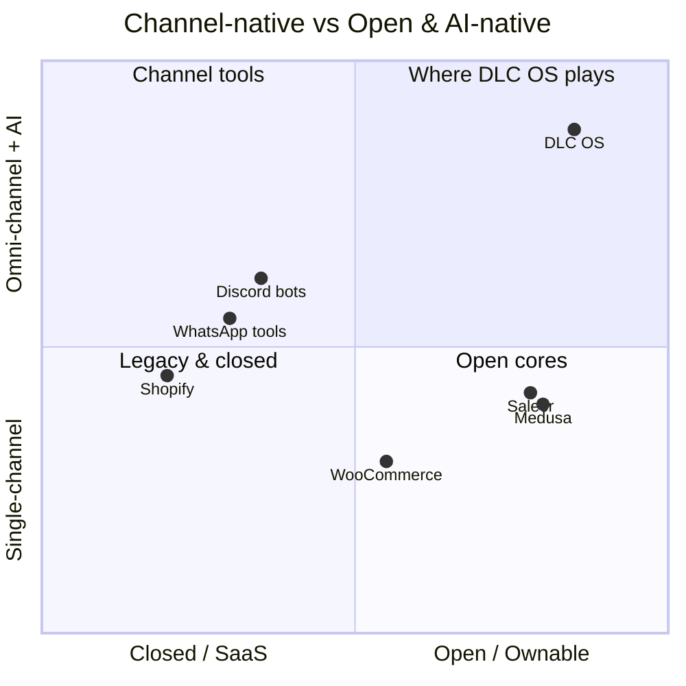

# 03 · Competitive Analysis

> Who else is in the space, what they do well, where they fall short, and the
> specific gap DLC OS fills.

## Landscape map

## Detailed comparison

| Capability | Shopify | WooCommerce | Medusa / Saleor | Discord/chat bots | **DLC OS** |
|---|---|---|---|---|---|
| Open source / self-host | ❌ | ✅ | ✅ | partial | ✅ |
| Web storefront | ✅ | ✅ | ✅ (headless) | ❌ | ✅ |
| Discord commerce (real checkout) | ❌ | ❌ | ❌ | ⚠️ shallow | ✅ |
| WhatsApp / Telegram commerce | ⚠️ apps | ⚠️ plugins | ❌ | ⚠️ partial | ✅ |
| Unified omni-channel data model | ❌ | ❌ | ⚠️ headless DIY | ❌ | ✅ |
| Native AI assistant (sell/support/forecast) | ⚠️ add-ons | ❌ | ❌ | ⚠️ scripted | ✅ |
| CRM + loyalty built in | ⚠️ basic/apps | ⚠️ plugins | ❌ | ❌ | ✅ |
| Multi-vendor marketplace | ⚠️ apps | ⚠️ plugins | ⚠️ DIY | ❌ | ✅ |
| Own your data / no lock-in | ❌ | ✅ | ✅ | ⚠️ | ✅ |
| Cost model | $$$ + apps + fees | hosting + plugins | infra + build | varies | **free core** |

(✅ strong · ⚠️ partial/via add-ons · ❌ absent)

## Competitor-by-competitor

### Shopify
- **Strengths:** category king, polished UX, huge app ecosystem, reliable checkout, brand trust.
- **Weaknesses:** closed and rented; channel-blind (Discord/Telegram are afterthoughts); AI bolted on via apps; costs stack via apps + transaction fees; you never own it.
- **DLC OS edge:** open & ownable, channel-native, AI-first, no app tax for core capabilities.

### WooCommerce
- **Strengths:** open, huge install base, infinitely pluggable, owns its data.
- **Weaknesses:** WordPress-bound, plugin-sprawl fragility, no native AI, not built for chat channels or modern omni-channel.
- **DLC OS edge:** modern async architecture, AI-native, channel-native, unified data model instead of plugin spaghetti.

### Medusa / Saleor (open-source headless)
- **Strengths:** excellent open-source commerce cores, developer-loved, composable, modern.
- **Weaknesses:** headless-by-default means *you* build the channels, AI, CRM, marketing, marketplace. No batteries-included omni-channel + AI experience.
- **DLC OS edge:** we are batteries-included for channels + AI + CRM + marketing on top of a modern core. We learn from their architecture and DX, and go broader on the experience.

### Discord / Telegram / WhatsApp bots & tools
- **Strengths:** meet customers where they are; lightweight.
- **Weaknesses:** shallow — usually no real checkout, no inventory truth, no unified records, no CRM, brittle, single-channel.
- **DLC OS edge:** a real commerce core *behind* the chat experience — proper checkout, inventory, orders, customer records, and AI that shares one brain across channels.

### AI commerce point tools
- **Strengths:** smart features (recommendations, support bots, copy generation).
- **Weaknesses:** they sit *beside* your data, not *inside* your platform; another silo.
- **DLC OS edge:** the AI lives on top of the unified data model with tools to actually act — order, refund, segment, forecast.

## The gap DLC OS fills

> **No one offers an open-source, AI-native, omni-channel commerce core where
> Discord/Telegram/WhatsApp are first-class citizens and the AI shares one brain
> across every channel.**

- Incumbents are **closed and channel-blind.**
- Open cores are **headless and DIY** for everything we make native.
- Bots are **shallow and single-channel.**
- AI tools are **another silo.**

## Positioning statement

> For businesses that sell across websites and chat channels and want an AI
> co-pilot without renting their stack, **DLC OS is the open-source AI commerce
> operating system** — unlike Shopify (closed, channel-blind) or bots (shallow),
> DLC OS unifies every channel and your data under one AI you own.

## Competitive strategy

1. **Don't fight Shopify head-on.** Win the wedge they ignore (chat-native + AI),
   then expand.
2. **Out-open the closed, out-experience the open.** More batteries than Medusa,
   more openness than Shopify.
3. **Make AI the reason to switch, ownership the reason to stay.**
4. **Community as moat.** Plugins, integrations, and contributors compound.

Next: [Architecture](./04-architecture.md)
