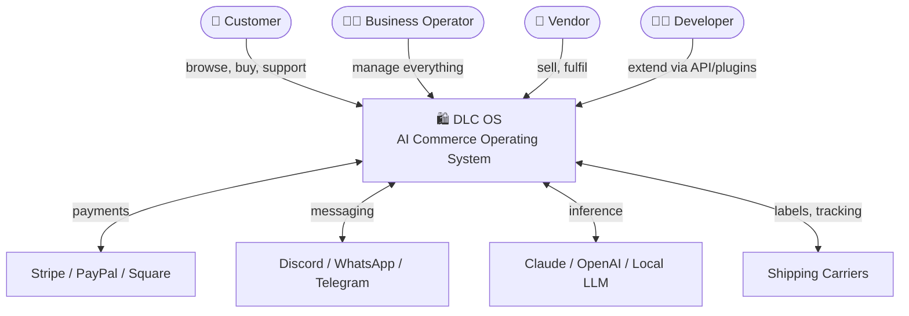
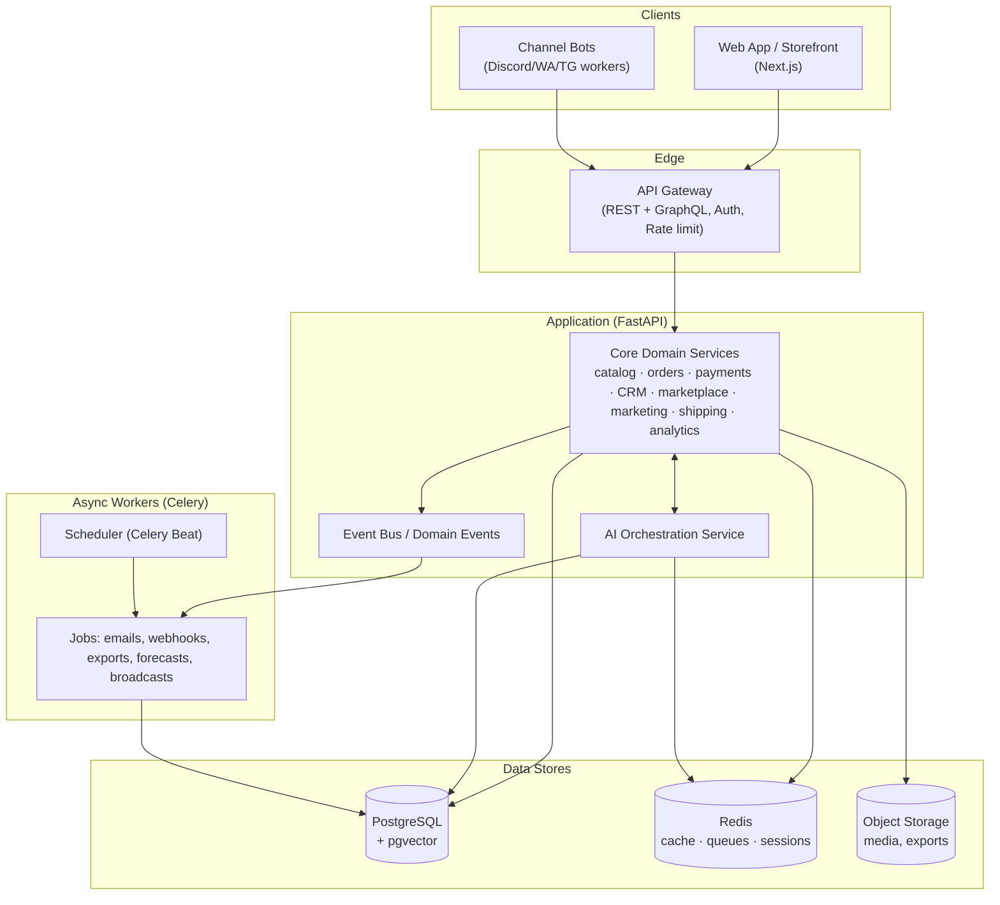
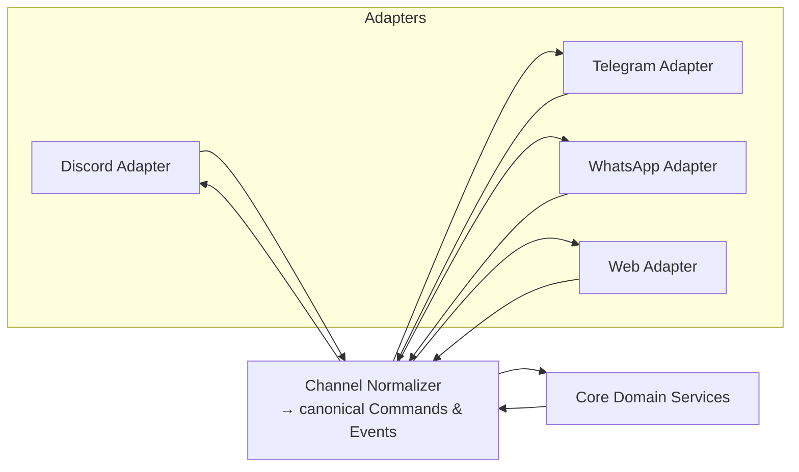
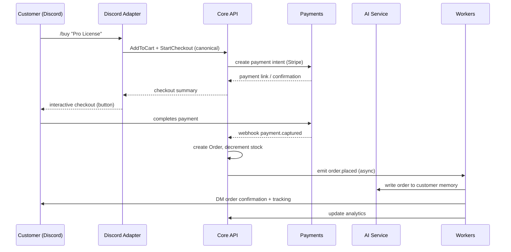

# 04 · Architecture

> How DLC OS is built: the system design, services, data flows, and the reasoning
> behind every major technology choice.

## Design goals

1. **One data model, many channels.** Channels are adapters over a single core.
2. **AI as a first-class subsystem**, not a feature — with its own services, memory, and guardrails.
3. **Modular monolith → services.** Start as a well-structured modular monolith for velocity; extract services as scale demands.
4. **Async everywhere.** Commerce is I/O-bound (APIs, webhooks, LLMs). FastAPI + async + a task queue.
5. **Event-driven.** Domain events decouple modules (an order placed triggers shipping, marketing, analytics, AI memory — without tight coupling).
6. **Self-hostable & cloud-native.** The same artifacts run on a laptop (Docker Compose) and a cluster (Kubernetes).

## C4 — Level 1: System context

## C4 — Level 2: Containers

## Logical modules

DLC OS is internally organized as bounded contexts. Each owns its tables, logic,
and events; they communicate through service interfaces and domain events.

| Bounded context | Responsibility | Key events emitted |
|---|---|---|
| **Identity & Access** | Users, orgs, roles, sessions, RBAC | `user.created`, `session.started` |
| **Catalog** | Products, variants, categories, bundles, media | `product.published`, `price.changed` |
| **Inventory** | Stock, warehouses, movements, alerts | `stock.low`, `stock.adjusted` |
| **Cart & Checkout** | Carts, pricing, discounts, tax | `cart.updated`, `checkout.completed` |
| **Orders** | Orders, fulfilment, returns, refunds | `order.placed`, `order.fulfilled`, `refund.issued` |
| **Payments** | Providers, transactions, verification, fraud | `payment.captured`, `payment.failed` |
| **CRM** | Customers, segments, notes, LTV, loyalty | `customer.tagged`, `segment.entered` |
| **Marketplace** | Vendors, commissions, payouts, rankings | `vendor.approved`, `payout.sent` |
| **Channels** | Discord/WA/TG/web adapters & sessions | `channel.message.received` |
| **Marketing** | Campaigns, broadcasts, referrals, affiliates | `campaign.sent`, `referral.converted` |
| **Shipping** | Shipments, labels, tracking | `shipment.created`, `delivery.updated` |
| **Analytics** | Metrics, reports, dashboards | — (consumer of events) |
| **AI** | Agents, memory, tools, RAG | `ai.action.taken` |

## Channel adapter pattern

The key architectural idea: **channels are thin adapters over one core.** A
"checkout" means the same thing on Discord and the web; only the presentation and
transport differ.

Each adapter:
- Translates platform events (a Discord slash command, a WhatsApp message) into **canonical commands** (`AddToCart`, `StartCheckout`).
- Renders canonical responses into platform-native UI (Discord embeds/buttons, Telegram inline keyboards, WhatsApp interactive messages, web React).
- Holds **no business logic** — that lives in the core.

Adding a new channel = writing one adapter. That's the moat.

## Example data flow — "Customer buys on Discord"

## AI subsystem (overview)

The AI service is a peer to the core, not buried in it. It:
- Hosts the **agent orchestrator** (planning, tool-calling).
- Manages **short-term** (conversation/session) and **long-term** (vector + structured) **memory**.
- Calls **tools** that map to real core APIs (search products, create order, issue refund, segment customers).
- Enforces **guardrails** (permissions, spend limits, confirmations for sensitive actions).

Full detail: [AI Architecture](./10-ai-architecture.md).

## Technology choices & rationale

| Choice | Why | Alternatives considered |
|---|---|---|
| **FastAPI (Python)** | Async, typed, fast to build, huge AI/ML ecosystem, great DX | Django (heavier), Node/Nest (less AI ecosystem) |
| **PostgreSQL** | Rock-solid relational core; `pgvector` gives us AI memory in the same DB; JSONB for flexibility | MySQL, MongoDB (weaker for transactional commerce) |
| **Redis** | Cache, sessions, rate limiting, Celery broker — one tool, many jobs | Memcached (less versatile) |
| **Celery** | Mature task queue for emails, webhooks, broadcasts, forecasts | RQ, Dramatiq, Arq (lighter but less ecosystem) |
| **Next.js + React + TS + Tailwind** | Best-in-class dashboard & storefront DX, SSR, huge talent pool | Remix, SvelteKit |
| **pgvector** | Vector search without a separate DB to start | Qdrant/Weaviate (add later at scale) |
| **Docker + Kubernetes** | Same artifacts laptop→cloud; standard ops | Nomad, bare VMs |
| **Provider-agnostic LLM layer** | Avoid lock-in; Claude/OpenAI/local interchangeable | Single-provider SDKs |

## Scaling path

1. **Stage 1 — Modular monolith.** One FastAPI app, clear module boundaries, Postgres + Redis + Celery. Runs on one box. Fast to build, easy to reason about.
2. **Stage 2 — Scale out workers & reads.** Horizontal API replicas, read replicas, more Celery workers, Redis cluster, object storage/CDN for media.
3. **Stage 3 — Extract services.** Pull high-load contexts (AI, channels, analytics) into independent deployables, communicating via the event bus (Redis Streams → Kafka/NATS if needed).
4. **Stage 4 — Multi-region & enterprise.** Regional DBs, data residency, dedicated tenants.

The module boundaries above are drawn so this extraction is mechanical, not a rewrite.

## Cross-cutting concerns

- **Multi-tenancy:** every row scoped by `organization_id`; strict tenant isolation at the query layer.
- **Observability:** structured logs, OpenTelemetry traces, metrics, Sentry. See [Deployment Guide](./15-deployment-guide.md).
- **Idempotency:** all webhook handlers and payment operations are idempotent (keys + dedupe).
- **Configuration:** 12-factor, env-driven (see `.env.example`).
- **Security:** see [Security Architecture](./09-security-architecture.md).

Next: [Database Schema](./05-database-schema.md) · [API Design](./06-api-design.md)
