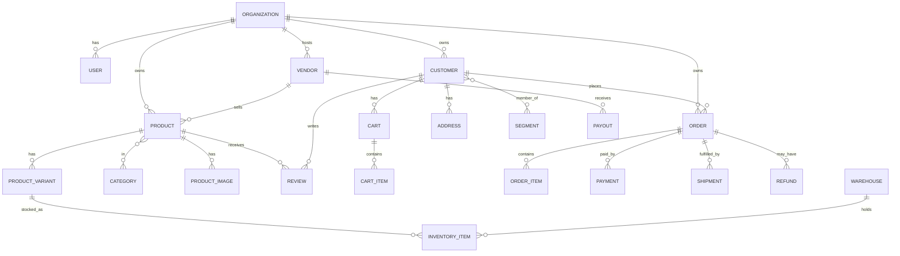

# 05 · Database Schema

> The data model that makes "one core, every channel" real. PostgreSQL, designed
> for multi-tenancy, multi-channel, and AI from day one.

## Conventions

- **Engine:** PostgreSQL 15+ with `pgvector` (AI memory) and `pgcrypto`.
- **Keys:** UUID primary keys (`id`), generated app-side or via `gen_random_uuid()`.
- **Multi-tenancy:** every business-owned table carries `organization_id`. All queries are tenant-scoped.
- **Money:** stored as integer **minor units** (cents) + ISO `currency` code. Never floats.
- **Timestamps:** `created_at`, `updated_at` (UTC, `timestamptz`); soft-delete via `deleted_at` where needed.
- **Enums:** Postgres enums or `text` + check constraints.
- **JSONB:** for flexible metadata (`metadata jsonb`) on most entities.

## Entity-relationship overview (core commerce)

## Schema, domain by domain

### 1. Identity & multi-tenancy

**`organizations`** — the tenant (a business).
| Column | Type | Notes |
|---|---|---|
| id | uuid PK | |
| name | text | |
| slug | text unique | |
| plan | text | free / pro / enterprise |
| settings | jsonb | branding, locale, currency defaults |
| created_at, updated_at | timestamptz | |

**`users`** — operators/admins (people who run the business).
| Column | Type | Notes |
|---|---|---|
| id | uuid PK | |
| organization_id | uuid FK | |
| email | citext unique | |
| password_hash | text | Argon2id |
| name | text | |
| status | text | active / invited / disabled |
| mfa_secret | text null | encrypted |
| last_login_at | timestamptz | |

**`roles`** / **`user_roles`** — RBAC.
| roles | | |
|---|---|---|
| id | uuid PK | |
| organization_id | uuid FK | |
| name | text | owner / admin / manager / support / vendor / custom |
| permissions | jsonb | array of permission keys |

`user_roles(user_id, role_id)` — many-to-many.

**`api_keys`** — programmatic access (hashed, scoped, rate-limited).

**`audit_logs`** — append-only record of sensitive actions (actor, action, target, before/after, ip, ts). See [Security](./09-security-architecture.md).

### 2. Catalog

**`products`**
| Column | Type | Notes |
|---|---|---|
| id | uuid PK | |
| organization_id | uuid FK | |
| vendor_id | uuid FK null | for marketplace |
| title | text | |
| slug | text | |
| description | text | |
| type | text | physical / digital / bundle / service |
| status | text | draft / active / archived |
| metadata | jsonb | |
| created_at, updated_at, deleted_at | timestamptz | |

**`product_variants`** — the actually-sellable unit (SKU).
| Column | Type | Notes |
|---|---|---|
| id | uuid PK | |
| product_id | uuid FK | |
| sku | text | |
| title | text | e.g. "Large / Black" |
| price_amount | bigint | minor units |
| currency | text | ISO 4217 |
| compare_at_amount | bigint null | for discounts |
| options | jsonb | {size: L, color: black} |
| is_digital | bool | |
| digital_asset_id | uuid null | downloadable/license |
| weight_grams | int null | shipping |

**`categories`** (self-referential tree) and **`product_categories`** (M:N).

**`product_images`** — ordered media (`url`, `alt`, `position`).

**`product_bundles`** / **`bundle_items`** — a bundle product composed of variants with quantities.

**`digital_assets`** — files/licenses for digital products (storage key, license type, download limits).

### 3. Inventory

**`warehouses`** — physical/logical stock locations (`name`, `address`, `is_default`).

**`inventory_items`** — stock of a variant at a warehouse.
| Column | Type | Notes |
|---|---|---|
| id | uuid PK | |
| variant_id | uuid FK | |
| warehouse_id | uuid FK | |
| quantity_on_hand | int | |
| quantity_reserved | int | held by open carts/orders |
| reorder_point | int | low-stock threshold |
| barcode | text null | |

**`inventory_movements`** — append-only ledger (`type`: sale/restock/adjustment/return, `delta`, `reason`, `reference_id`). Source of truth for forecasting.

### 4. Customers & CRM

**`customers`**
| Column | Type | Notes |
|---|---|---|
| id | uuid PK | |
| organization_id | uuid FK | |
| email | citext null | |
| phone | text null | |
| name | text null | |
| channel_identities | jsonb | {discord_id, telegram_id, wa_phone} |
| lifetime_value | bigint | cached, recomputed |
| tags | text[] | |
| metadata | jsonb | |
| created_at | timestamptz | |

> **Identity resolution:** `channel_identities` lets one human be recognized across
> Discord, Telegram, WhatsApp, and web → a single customer record.

**`addresses`** — shipping/billing (`line1/2`, `city`, `region`, `postal`, `country`, `is_default`).

**`customer_notes`** — freeform notes by operators/AI (`body`, `author_type`, `created_at`).

**`segments`** / **`customer_segments`** — saved audiences. A segment stores a `rule` (jsonb) + materialized membership.

**`loyalty_accounts`** / **`loyalty_transactions`** — points balance & ledger.

**`communications`** — unified message history across channels (`channel`, `direction`, `body`, `customer_id`, `ts`) — powers the 360° timeline and AI context.

### 5. Cart & checkout

**`carts`** (`customer_id` null for guests, `channel`, `status`, `currency`).

**`cart_items`** (`cart_id`, `variant_id`, `quantity`, `unit_amount`).

**`discounts`** — coupons & automatic rules.
| Column | Type | Notes |
|---|---|---|
| id | uuid PK | |
| organization_id | uuid FK | |
| code | text null | null = automatic |
| type | text | percentage / fixed / free_shipping / bxgy |
| value | bigint | |
| conditions | jsonb | min spend, products, segments |
| usage_limit, used_count | int | |
| starts_at, ends_at | timestamptz | |

### 6. Orders, payments, returns

**`orders`**
| Column | Type | Notes |
|---|---|---|
| id | uuid PK | |
| organization_id | uuid FK | |
| customer_id | uuid FK | |
| channel | text | discord/web/telegram/whatsapp |
| status | text | pending/paid/fulfilled/cancelled/refunded |
| subtotal_amount, discount_amount, tax_amount, shipping_amount, total_amount | bigint | |
| currency | text | |
| vendor_id | uuid null | marketplace |
| placed_at | timestamptz | |
| metadata | jsonb | |

**`order_items`** (`order_id`, `variant_id`, `quantity`, `unit_amount`, `total_amount`, `vendor_id`).

**`payments`**
| Column | Type | Notes |
|---|---|---|
| id | uuid PK | |
| order_id | uuid FK | |
| provider | text | stripe/paypal/square/crypto/manual |
| provider_ref | text | external id |
| amount, currency | bigint/text | |
| status | text | pending/captured/failed/refunded |
| fraud_score | numeric null | |
| raw | jsonb | provider payload |

**`refunds`** (`payment_id`, `amount`, `reason`, `status`, `is_partial`).

**`returns`** (`order_id`, `items`, `status`, `resolution`).

### 7. Marketplace

**`vendors`**
| Column | Type | Notes |
|---|---|---|
| id | uuid PK | |
| organization_id | uuid FK | |
| name | text | |
| status | text | pending/verified/suspended |
| commission_rate | numeric | % to platform |
| payout_account | jsonb | Stripe Connect ref |
| rating | numeric | |
| metadata | jsonb | |

**`commissions`** (`order_item_id`, `vendor_id`, `amount`, `rate`).

**`payouts`** (`vendor_id`, `amount`, `period`, `status`, `provider_ref`).

**`vendor_reviews`** (`vendor_id`, `customer_id`, `rating`, `body`).

### 8. Reviews & ratings

**`reviews`** (`product_id`, `customer_id`, `rating` 1–5, `title`, `body`, `status` pending/published, `verified_purchase` bool).

### 9. Shipping

**`shipments`** (`order_id`, `carrier`, `tracking_number`, `label_url`, `status`, `estimated_delivery`).

**`shipment_events`** — tracking timeline (`status`, `description`, `location`, `ts`).

### 10. Marketing

**`campaigns`** (`type` email/sms/whatsapp/push, `segment_id`, `content` jsonb, `status`, `scheduled_at`, `metrics` jsonb).

**`referrals`** (`referrer_customer_id`, `code`, `referred_customer_id`, `reward`, `status`).

**`affiliates`** / **`affiliate_clicks`** / **`affiliate_conversions`** — affiliate program tracking.

### 11. AI subsystem

**`ai_conversations`** (`customer_id` or `user_id`, `channel`, `started_at`).

**`ai_messages`** (`conversation_id`, `role` user/assistant/tool, `content`, `tool_calls` jsonb, `ts`).

**`ai_memories`** — long-term memory.
| Column | Type | Notes |
|---|---|---|
| id | uuid PK | |
| organization_id | uuid FK | |
| subject_type | text | customer / org / product |
| subject_id | uuid | |
| content | text | the fact/summary |
| embedding | vector(1536) | pgvector |
| importance | numeric | |
| created_at | timestamptz | |

**`ai_actions`** — audit of actions the AI took (`tool`, `params`, `result`, `actor_confirmation`). Critical for trust & safety.

### 12. Events & jobs

**`domain_events`** — event log (`type`, `payload` jsonb, `occurred_at`, `processed`) enabling event-driven workflows, replay, and analytics.

**`webhook_deliveries`** — outbound webhooks to user systems (`event`, `url`, `status`, `attempts`).

## Indexing & performance notes

- Composite indexes on `(organization_id, <frequently filtered column>)` for tenant-scoped queries.
- `orders(organization_id, placed_at)`, `customers(organization_id, email)`, `inventory_items(variant_id, warehouse_id)`.
- `ai_memories` uses an IVFFlat/HNSW index on `embedding` for vector search.
- Partition high-volume tables (`domain_events`, `communications`, `inventory_movements`) by time as they grow.

## Migrations

Schema is managed with **Alembic** (Python). Every change ships as a reviewed,
reversible migration. See [Implementation Plan](./20-implementation-plan.md).

Next: [API Design](./06-api-design.md)
