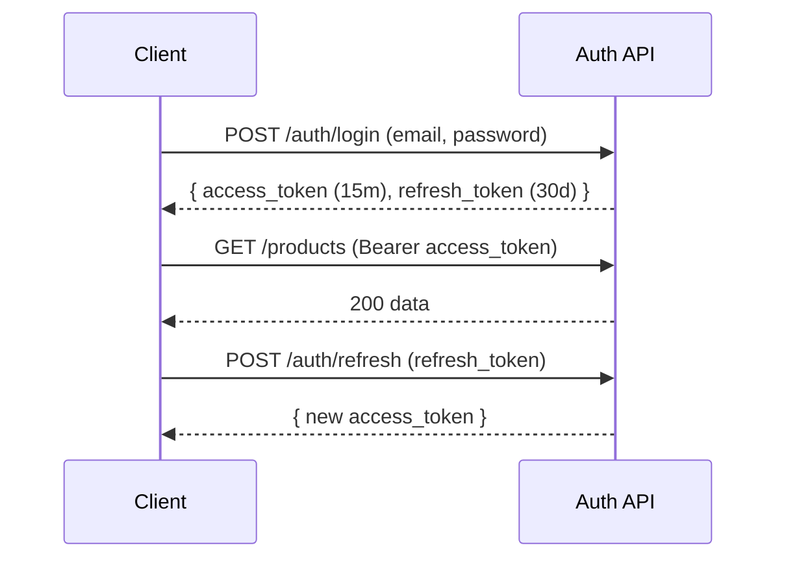

# 06 · API Design

> The contract every channel, plugin, and integration is built on. RESTful,
> versioned, predictable, and AI-tool-friendly.

## Principles

1. **Resource-oriented REST** for the public API; **GraphQL** for flexible
   dashboard/storefront reads; **webhooks + WebSockets** for real-time.
2. **Versioned** — `/api/v1/...`. Breaking changes bump the version.
3. **Consistent envelopes**, predictable errors, cursor pagination everywhere.
4. **Auth = JWT (users) or API key (machines)**; everything tenant-scoped & RBAC-checked.
5. **Idempotent writes** via `Idempotency-Key` header.
6. **Every endpoint is an AI tool candidate** — clean, well-described operations the agent can call.

## Base & conventions

```
Base URL:   https://api.dlc-os.dev/api/v1
Auth:       Authorization: Bearer <jwt>      (users)
            X-API-Key: <key>                 (machines)
Tenancy:    inferred from token; X-Org-Id for multi-org users
Content:    application/json
Idempotency: Idempotency-Key: <uuid> on POST/PUT
```

### Standard response envelope

```jsonc
// success
{ "data": { /* resource or list */ }, "meta": { "request_id": "..." } }

// list with pagination
{ "data": [ /* items */ ],
  "meta": { "next_cursor": "eyJpZCI6...", "has_more": true } }

// error
{ "error": { "code": "validation_error",
             "message": "price_amount must be >= 0",
             "details": [ { "field": "price_amount", "issue": "min" } ],
             "request_id": "req_123" } }
```

### Error codes (HTTP + app code)

| HTTP | code | When |
|---|---|---|
| 400 | `validation_error` | bad input |
| 401 | `unauthenticated` | missing/invalid token |
| 403 | `forbidden` | RBAC denied |
| 404 | `not_found` | resource/tenant mismatch |
| 409 | `conflict` | idempotency / state conflict |
| 422 | `unprocessable` | semantically invalid |
| 429 | `rate_limited` | throttled (see `Retry-After`) |
| 500 | `internal_error` | server fault (with `request_id`) |

## Authentication flow



Endpoints: `POST /auth/register`, `/auth/login`, `/auth/refresh`, `/auth/logout`,
`/auth/mfa/verify`, `POST /auth/api-keys`.

## Core resource endpoints (selection)

### Catalog
| Method | Path | Purpose |
|---|---|---|
| GET | `/products` | list/search/filter products |
| POST | `/products` | create product |
| GET | `/products/{id}` | retrieve |
| PATCH | `/products/{id}` | update |
| DELETE | `/products/{id}` | archive |
| POST | `/products/{id}/variants` | add variant |
| GET | `/categories` | category tree |

### Cart & checkout
| Method | Path | Purpose |
|---|---|---|
| POST | `/carts` | create cart (any channel) |
| POST | `/carts/{id}/items` | add item |
| PATCH | `/carts/{id}/items/{itemId}` | update qty |
| POST | `/carts/{id}/discounts` | apply coupon |
| POST | `/checkout` | start checkout from a cart |
| POST | `/checkout/{id}/complete` | finalize after payment |

### Orders
| Method | Path | Purpose |
|---|---|---|
| GET | `/orders` | list/filter |
| GET | `/orders/{id}` | retrieve + items + payments + shipments |
| POST | `/orders/{id}/fulfil` | mark/trigger fulfilment |
| POST | `/orders/{id}/refunds` | issue (partial) refund |
| POST | `/orders/{id}/returns` | start return |

### Customers / CRM
`GET/POST /customers`, `GET /customers/{id}` (360° view), `POST /customers/{id}/notes`,
`GET/POST /segments`, `GET /customers/{id}/communications`.

### Payments
`POST /payments/intents`, `POST /payments/{id}/capture`, `POST /webhooks/stripe`
(+ `/paypal`, `/square`, `/crypto`). All webhook handlers verify signatures & are idempotent.

### Marketplace
`GET/POST /vendors`, `POST /vendors/{id}/verify`, `GET /vendors/{id}/payouts`,
`POST /payouts/run`.

### Marketing
`GET/POST /campaigns`, `POST /campaigns/{id}/send`, `GET/POST /referrals`,
`GET/POST /affiliates`.

### Analytics
`GET /analytics/revenue?from&to&granularity`, `/analytics/customers`,
`/analytics/products`, `/analytics/vendors`, `POST /reports/generate` (AI).

### AI
| Method | Path | Purpose |
|---|---|---|
| POST | `/ai/chat` | converse with the assistant (streaming) |
| POST | `/ai/voice` | voice in/out session token |
| GET | `/ai/memory?subject=` | inspect long-term memory |
| POST | `/ai/actions/confirm` | approve a sensitive proposed action |

## Example request/response

```http
POST /api/v1/products HTTP/1.1
Authorization: Bearer eyJ...
Idempotency-Key: 7b1c...
Content-Type: application/json

{
  "title": "Pro License",
  "type": "digital",
  "status": "active",
  "variants": [
    { "sku": "PRO-1Y", "title": "1 Year", "price_amount": 4900, "currency": "USD", "is_digital": true }
  ]
}
```
```jsonc
HTTP/1.1 201 Created
{ "data": { "id": "prod_01H...", "title": "Pro License",
            "variants": [ { "id": "var_01H...", "sku": "PRO-1Y", "price_amount": 4900 } ] },
  "meta": { "request_id": "req_abc" } }
```

## Pagination, filtering, sorting

```
GET /orders?status=paid&channel=discord&sort=-placed_at&limit=50&cursor=<opaque>
```
Cursor-based (stable under writes). `limit` default 25, max 100.

## Real-time

- **Webhooks** (outbound): subscribe org systems to events (`order.placed`, `payment.captured`, …). Signed (`X-DLCOS-Signature`), retried with backoff, logged in `webhook_deliveries`.
- **WebSockets**: live dashboard updates, AI streaming tokens, channel message streams.

## GraphQL (dashboard/storefront reads)

A typed GraphQL endpoint (`/graphql`) for flexible, nested reads where REST would
mean many round-trips (e.g. a storefront product page with variants, images,
reviews, and inventory in one query). Writes stay on REST for clarity & idempotency.

## Rate limiting

Token-bucket in Redis, per API key/user/IP. Tiers by plan. Responses include
`X-RateLimit-Limit/Remaining/Reset`; 429 returns `Retry-After`. See [Security](./09-security-architecture.md).

## OpenAPI & SDKs

FastAPI generates an **OpenAPI 3.1** spec automatically. From it we ship:
- Interactive docs (Swagger/Redoc) at `/docs`.
- Generated SDKs (TypeScript, Python) for plugins & integrations.
- **AI tool schemas** — the same OpenAPI operations are exposed to the agent as callable tools (see [AI Architecture](./10-ai-architecture.md)).

Next: [Folder Structure](./07-folder-structure.md)
