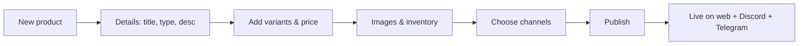
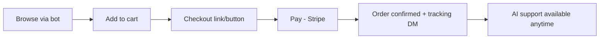
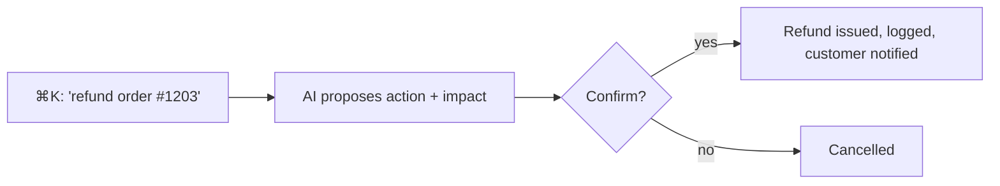

# 08 · UI/UX System

> A modern, AI-first SaaS experience: Shopify-level polish, dark mode by default,
> mobile-responsive, with the AI assistant woven through every surface.

## Design principles

1. **AI-first.** A command/assistant bar is always one keystroke away (`⌘K`). The
   AI can answer, navigate, and *act* ("refund order #1203", "show me low-stock items").
2. **One mental model, every channel.** The dashboard reflects the unified data
   model: a customer, order, or product looks the same regardless of channel.
3. **Progressive disclosure.** Simple by default; depth on demand. A solo seller
   and an enterprise operator both feel at home.
4. **Fast & responsive.** Optimistic UI, skeleton states, keyboard-navigable.
5. **Accessible.** WCAG 2.1 AA: contrast, focus states, ARIA, reduced-motion.

## Design tokens

| Token | Light | Dark (default) |
|---|---|---|
| `--bg` | `#FFFFFF` | `#0B0D12` |
| `--surface` | `#F7F8FA` | `#13161D` |
| `--border` | `#E5E7EB` | `#232733` |
| `--text` | `#0B0D12` | `#E8EAED` |
| `--muted` | `#6B7280` | `#9AA3B2` |
| `--primary` | `#5B5BD6` (indigo) | `#7C7CF0` |
| `--success` | `#16A34A` | `#34D399` |
| `--warning` | `#D97706` | `#FBBF24` |
| `--danger` | `#DC2626` | `#F87171` |

- **Typography:** Inter (UI), JetBrains Mono (code/IDs). Scale: 12/14/16/20/24/32/40.
- **Spacing:** 4px base grid (4/8/12/16/24/32/48/64).
- **Radius:** 8px controls, 12px cards, 16px modals. **Shadows:** subtle, elevation-based.
- Delivered as CSS variables + a Tailwind preset in `packages/config`, consumed by `packages/ui`.

## Component library (`packages/ui`)

Buttons, Inputs, Select, Combobox, Table (sortable/filterable/virtualized),
Card, Tabs, Drawer, Modal, Toast, Badge, Avatar, Stat/KPI, Chart wrappers,
EmptyState, CommandBar, ChatPanel, DataGrid, DateRangePicker, FileUpload. All
themed via tokens, documented in Storybook.

## Navigation structure

```
Top bar: org switcher · global search/⌘K · notifications · profile

Sidebar
  🏠 Overview
  🛒 Catalog → Products · Categories · Bundles · Inventory
  📦 Orders → All · Returns · Refunds
  👥 Customers → Profiles · Segments · Loyalty
  🏪 Marketplace → Vendors · Commissions · Payouts
  💬 Channels → Discord · WhatsApp · Telegram · Web
  📣 Marketing → Campaigns · Referrals · Affiliates · Coupons
  🚚 Shipping
  📊 Analytics → Revenue · Customers · Products · Vendors
  🤖 Assistant → (AI chat / voice)
  ⚙️ Settings → Team · Roles · Payments · Channels · API · Billing
```

## Key screens (wireframes)

> Rendered as labelled panels (`▸` = a screen region). The real UI is fully
> bordered cards; these sketches focus on content and hierarchy.

### Overview / Home

```
▸ Topbar
    Good morning, Maya     [ Ask the assistant… ⌘K ]

▸ KPIs
    Revenue (7d) — $12,480 (▲14%)
    Orders (7d) — 312 (▲6%)
    New customers — 89 (▲9%)
    Conv. rate — 3.4% (▼0.2%)

▸ Panels
    Revenue over time — ▁▂▃▅▆▇█ (line chart)
    Channel mix — Discord 41% · Web 33% · …

▸ 🤖 AI Brief
    "Sales up 14% w/w driven by Discord. 'Pro License' is
     trending. 3 SKUs are low on stock — want me to reorder?"
    [ Generate full report ]  [ Review low stock ]

▸ Recent orders
    #1203 · $49 · Discord · paid
    #1202 · $120 · Web · fulfilled

▸ Needs attention
    • 2 tickets open
    • 1 refund req
```

### Products list

```
▸ Products     [ + New product ]
    Filters: [search] Status▾ Type▾ Channel▾ Vendor▾  [ ⌘K AI ]

    ☐ 🖼 Pro License — digital · $49 · stock ∞ · ● Active
    ☐ 🖼 Hoodie (Black) — physical · $60 · stock 12 · ● Active
    ☐ 🖼 Starter Bundle — bundle · $99 · stock — · ◌ Draft

    Bulk: [ Publish ] [ Archive ] [ Edit price ]   1–20 of 142 ▸
```

### Customer 360°

```
▸ Sarah Lee · sarah@… · LTV $640 · ⭐ VIP
    Tags: [returning] [discord]     [ Message ] [ Note ]

▸ Timeline
    • Bought Pro License
    • DM on Discord
    • Opened campaign
    • Left 5★ review

▸ Orders (8)
    #1203 · $49 · paid · Discord
    #1180 · $120 · fulfilled · Web
    Loyalty: 640 pts
    Segments: VIP, Newsletter

▸ 🤖 "Sarah buys every ~30 days; last order 34 days ago.
    Suggest a win-back with her favorite category."
```

### AI Assistant surface

```
▸ Assistant     [ 🎤 voice ]
    You: How did Discord sales do this week and what's low?

    🤖 Discord did $5,118 (41% of revenue, ▲22% w/w).
    Low stock: Hoodie-Black (12), Mug (4), Cap (7).
    ▸ [ Reorder all ]  ▸ [ Make a campaign ]  ▸ [ Report ]

    [ Type a message… ➤ ]
    Suggestions: "Refund #1203" · "Top customers" · "Forecast"
```

## Core user flows

### Operator: create & publish a product


### Customer: buy on a chat channel


### Operator: AI-assisted action


## Responsive & dark mode

- **Mobile-first**: sidebar collapses to a bottom tab bar + drawer; tables become cards; the ⌘K bar becomes a floating button.
- **Dark mode is the default**, light mode a toggle; both ship from the same tokens.
- Breakpoints: `sm 640 · md 768 · lg 1024 · xl 1280 · 2xl 1536`.

## From design to build

Tokens → `packages/config` (Tailwind preset) → `packages/ui` (components, Storybook)
→ consumed by `apps/web`. Figma library mirrors the token names so design and code
never drift. See [Folder Structure](./07-folder-structure.md).

Next: [Security Architecture](./09-security-architecture.md)
