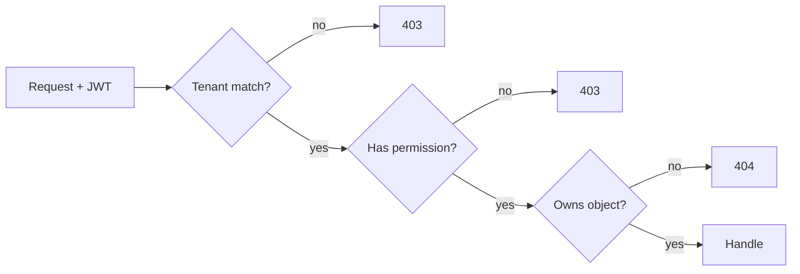

# 09 · Security Architecture

> DLC OS handles orders, customer PII, and money. Security is foundational, not a
> feature. This document covers authentication, authorization, data protection,
> auditing, rate limiting, and fraud detection.

## Threat model (what we defend against)

| Threat | Examples | Primary defenses |
|---|---|---|
| Account takeover | credential stuffing, phishing | Argon2id, MFA, rate limits, anomaly detection |
| Broken access control | tenant data leakage, privilege escalation | Tenant scoping, RBAC, object-level checks |
| Injection | SQL, prompt injection | Parameterized queries (ORM), AI guardrails |
| Payment fraud | stolen cards, chargebacks | Provider tooling + fraud scoring |
| Data exposure | PII leak, secret leak | Encryption, secret management, least privilege |
| Abuse/DoS | scraping, brute force, spam | Rate limiting, WAF, quotas |
| Supply chain | malicious deps | SCA scanning, pinned deps, signed releases |

## Authentication (AuthN)

- **Passwords:** Argon2id hashing, breach-list checks, strength rules.
- **MFA:** TOTP (and WebAuthn/passkeys on the roadmap), enforced for admin roles.
- **Sessions:** short-lived JWT **access** tokens (15 min) + rotating **refresh**
  tokens (30 days) stored httpOnly/secure; refresh rotation with reuse detection.
- **Machine auth:** scoped, hashed **API keys** (prefix + secret), revocable.
- **SSO/SAML/OIDC:** enterprise tier (see [Phase 3](./14-phase-3-roadmap.md)).
- **Channel identity:** Discord/Telegram/WhatsApp identities are linked to customer
  records but never grant operator access.

## Authorization (AuthZ) & RBAC

Every request is authorized at two levels:

1. **Tenant scope** — the token's `organization_id` must match the resource's. Enforced in a base query layer so it can't be forgotten.
2. **Role & permission** — RBAC with granular permission keys.

### Default roles

| Role | Can | Cannot |
|---|---|---|
| **Owner** | everything incl. billing, delete org | — |
| **Admin** | manage catalog, orders, customers, settings, team | delete org, billing |
| **Manager** | catalog, orders, marketing | team, API keys, payouts |
| **Support** | view orders/customers, respond, refund within limit | edit catalog, settings |
| **Vendor** | own products, own orders, own payouts | other vendors' data, platform settings |
| **Custom** | any subset of permission keys | — |

Permission keys are fine-grained: `product.write`, `order.refund`, `payout.run`,
`customer.read`, `ai.act`, `settings.manage`, … RBAC for the AI is **the same
system** — the agent acts under a role with explicit, auditable permissions.

## Data protection & encryption

- **In transit:** TLS 1.2+ everywhere; HSTS; secure cookies.
- **At rest:** database & object storage encryption; sensitive columns (MFA
  secrets, payout details, tokens) additionally encrypted app-side (`pgcrypto`/KMS).
- **Secrets:** never in code; injected via env/secret manager (Vault/cloud KMS).
- **PII minimization:** store only what's needed; configurable retention; export &
  deletion endpoints for **GDPR/CCPA** (right to access/erasure).
- **Payment data:** we **do not store raw card data** — tokenized via Stripe/PayPal
  to minimize **PCI** scope (SAQ-A posture). See [Payments](./modules/10-payments.md).
- **Tenant isolation:** every row carries `organization_id`; enterprise option for
  schema/DB-per-tenant.

## Audit logging

Append-only `audit_logs` capture **who did what to what, when, from where**, with
before/after for sensitive changes (refunds, role changes, payout config, settings).
Immutable, exportable, queryable in the dashboard. **All AI actions are audited**
in `ai_actions` with the prompt, tool, params, and confirmation status.

## Rate limiting & abuse prevention

- **Token-bucket** limits in Redis, per API key / user / IP, tiered by plan.
- Stricter limits on auth endpoints (login, refresh, password reset) to stop brute force.
- Bot/scraping protection on public storefront & bot endpoints.
- Standard headers (`X-RateLimit-*`), `429 + Retry-After`.
- Optional WAF/CDN (Cloudflare) in front for L7 protection & DDoS mitigation.

## Fraud detection

A layered approach (deepens by phase — see [Payments module](./modules/10-payments.md)):

1. **Provider-native** (Stripe Radar, PayPal) — first line, leverages network-scale signals.
2. **Rules engine** — velocity checks, mismatched geo/IP, disposable emails, value thresholds, new-account + high-value.
3. **ML scoring (Phase 3)** — model trained on the org's own order history (needs data first; honestly sequenced late).
4. **Operator workflow** — flagged orders enter a review queue; AI summarizes risk; human decides. Outcomes feed back into the rules/model.

## Application security practices

- **Input validation** via Pydantic on every endpoint; output encoding in the UI.
- **ORM/parameterized queries** — no string-built SQL.
- **CSRF** protection for cookie-based flows; **CORS** locked to known origins.
- **Security headers:** CSP, X-Frame-Options, X-Content-Type-Options, Referrer-Policy.
- **Dependency & container scanning** in CI (SCA, image scan, secret scan).
- **Signed, reproducible releases**; SBOM published.

## AI-specific security

The AI is powerful, so it's fenced (full detail in [AI Architecture](./10-ai-architecture.md)):
- **Prompt-injection defense:** untrusted content (customer messages, product text) is treated as data, not instructions; tool use is allowlisted.
- **Least privilege:** the agent runs under an RBAC role; it can only call tools it's permitted to.
- **Human-in-the-loop:** sensitive actions (refunds, payouts, bulk messaging, deletions) require explicit confirmation and are rate-limited and audited.
- **Spend/impact limits:** caps on refund amounts, message volume, etc., per role.
- **PII handling:** memory redaction options; configurable data sent to external LLM providers; local-LLM option for sensitive deployments.

## Compliance posture

- **GDPR/CCPA:** data access/erasure/portability endpoints, consent tracking, DPA.
- **PCI DSS:** minimized scope via tokenization (SAQ-A).
- **SOC 2 (roadmap):** audit logging, access controls, and change management are built to support a future SOC 2 effort.
- **Money movement:** marketplace payouts go through Stripe Connect/PayPal so DLC OS
  **never custodies funds** — avoiding money-transmitter licensing. (See
  [Marketplace](./modules/06-marketplace.md) & [Payments](./modules/10-payments.md).)

## Responsible disclosure

See [SECURITY.md](../SECURITY.md) for how to report vulnerabilities.

Next: [AI Architecture](./10-ai-architecture.md)
