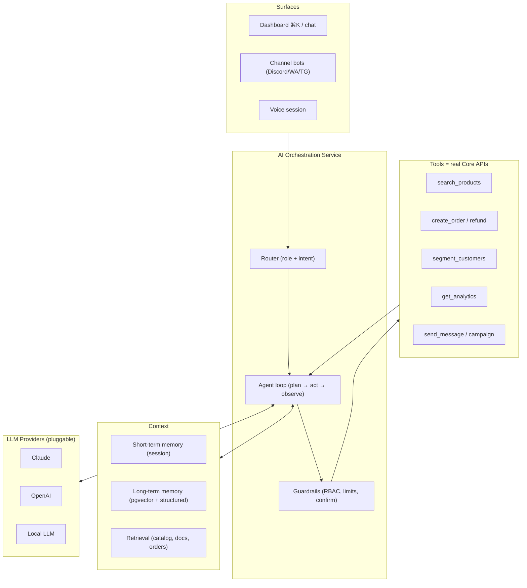
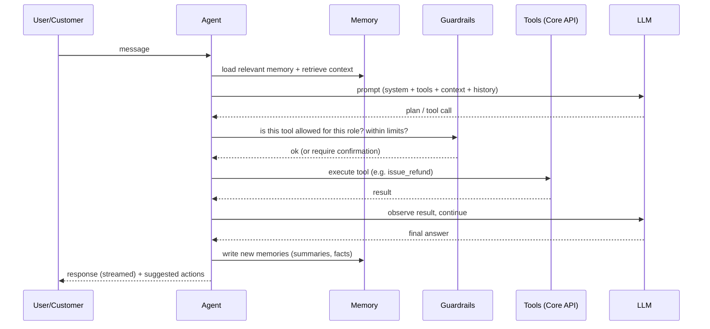
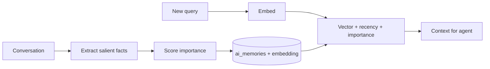

# 10 · AI Architecture

> The AI is not a chatbot bolted onto DLC OS — it is a subsystem that can *see* the
> whole business (via one data model) and *act* on it (via real tools), with
> memory, guardrails, and provider independence.

## What the AI does

| Capability | How it works |
|---|---|
| Voice & text conversations | Streaming chat + speech-to-text/text-to-speech (voice) |
| Short & long-term memory | Session memory + vector/structured long-term memory per subject |
| Business / sales / support assistant | One agent, different roles & tool sets per surface |
| Product recommendations | Retrieval over catalog + customer history + behavior |
| Workflow automation | Agent plans multi-step tasks, calls tools, asks for confirmation |
| Reporting & analytics | Queries analytics tools, summarizes, generates reports |
| Inventory forecasting | Time-series over `inventory_movements` (Phase 3, needs data) |
| Marketing suggestions | Segments + performance → campaign ideas |

## High-level design



## The agent loop



## Memory system

A two-tier memory keyed by **subject** (customer, organization, product, vendor):

- **Short-term (session):** the current conversation, recent actions, ephemeral
  state. Stored in Redis; bounded by a token budget with rolling summarization.
- **Long-term:** durable facts and summaries in `ai_memories`
  (`content` + `embedding vector` + `importance` + `subject`). Written when the
  agent learns something worth keeping ("prefers express shipping", "VIP, churned
  once"). Retrieved by vector similarity + recency + importance.



This is what makes the assistant feel like it *knows the business* — and it lives
in the same Postgres (via pgvector) as the commerce data, so memory and facts stay
consistent.

## Retrieval (RAG)

For grounded answers, the agent retrieves from:
- **Catalog** (semantic product search for recommendations & Q&A),
- **Order/customer data** (scoped, permissioned),
- **Knowledge base** (org's policies, FAQs, docs) for support.

Retrieval results are injected as *context*, clearly separated from instructions to
resist prompt injection.

## Tools = real APIs

The agent's tools are thin wrappers over the same Core APIs documented in
[API Design](./06-api-design.md). One source of truth; no shadow logic.

```jsonc
// Example tool schema exposed to the model
{
  "name": "issue_refund",
  "description": "Refund all or part of a paid order. Sensitive: requires confirmation.",
  "input_schema": {
    "type": "object",
    "properties": {
      "order_id": { "type": "string" },
      "amount":   { "type": "integer", "description": "minor units; omit for full" },
      "reason":   { "type": "string" }
    },
    "required": ["order_id"]
  },
  "sensitivity": "high"
}
```

Tool catalog (subset): `search_products`, `recommend_products`, `get_order`,
`create_order`, `issue_refund`, `get_customer`, `add_note`, `segment_customers`,
`get_analytics`, `generate_report`, `create_campaign`, `send_message`,
`forecast_inventory`, `create_shipment`.

## Guardrails & safety

Powerful tools demand strong fences (see [Security](./09-security-architecture.md)):

1. **RBAC for the AI** — the agent runs under a role; it can only call tools that
   role permits. No special backdoor.
2. **Human-in-the-loop** — `sensitivity: high` tools (refunds, payouts, bulk
   messaging, deletions) require explicit confirmation in the UI.
3. **Limits** — caps on refund amount, message volume, batch size per role/time.
4. **Prompt-injection defense** — customer/product text is data, never instructions;
   tool allowlists; output validation.
5. **Full audit** — every action logged in `ai_actions` (prompt, tool, params,
   result, confirmer).
6. **PII controls** — redaction options; choose what leaves the building; local-LLM
   mode for sensitive data.

## Provider abstraction (no lock-in)

A single internal interface; providers are swappable per task, per org, or per
deployment.

```python
class LLMProvider(Protocol):
    async def complete(self, messages, tools=None, *, model, stream=False): ...
    async def embed(self, texts) -> list[Vector]: ...

# config-driven selection
provider = registry.get(settings.LLM_DEFAULT_PROVIDER)   # anthropic | openai | local
```

- **Claude** — default for reasoning, tool use, long context.
- **OpenAI** — alternative/complement.
- **Local LLM** (e.g. via Ollama) — privacy-sensitive or cost-sensitive deployments.
- **Routing:** cheap models for classification/extraction, strong models for
  reasoning/agentic work; configurable per org to control cost.

## Voice

Voice sessions add streaming **speech-to-text** (input) and **text-to-speech**
(output) around the same agent loop, so the spoken assistant has identical
capabilities and guardrails as text. Used both for operator hands-free control and
customer voice support.

## Cost, latency & reliability

- **Caching** of embeddings and frequent retrievals.
- **Token budgeting** with rolling summaries to bound context size.
- **Streaming** responses for perceived speed.
- **Fallbacks** — if a provider errors/times out, route to a backup provider/model.
- **Async** — long tasks (forecasts, reports, batch ops) run on Celery workers.

## Honest sequencing

Not all AI features are equal at day one:
- **Available immediately:** support, recommendations, Q&A, reporting, automation
  (these need only the catalog/orders that exist).
- **Needs data first (Phase 3):** inventory forecasting and ML fraud scoring are
  *data* problems — they require order history before they're useful. We ship them
  when the data justifies them, not before. (See [Roadmap](./11-development-roadmap.md).)

Next: [Development Roadmap](./11-development-roadmap.md)
