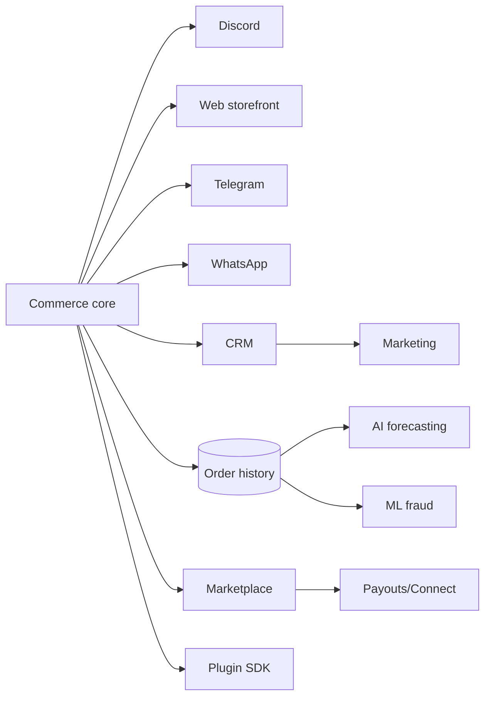

# 11 · Development Roadmap

> The full journey from blueprint to commerce operating system — phased so each
> stage ships something lovable, earns users, and de-risks the next.

## Guiding strategy

- **Win a wedge, then expand.** Don't out-feature Shopify on day one. Own the
  underserved chat-native + AI wedge, earn a community and real usage, then grow
  into the full OS.
- **Every phase ships value.** No "big bang." Each phase is independently useful.
- **Sequence around real constraints.** WhatsApp API approval, marketplace payout
  compliance, and AI-needs-data are planned around, not wished away.

## Phase overview

```mermaid
gantt
    title DLC OS — Development Phases (relative)
    dateFormat  X
    axisFormat %s
    section Phase 0
    Foundation & scaffolding        :0, 1
    section Phase 1 (MVP)
    Commerce core + Discord + AI     :1, 4
    section Phase 2
    Multi-channel + CRM + marketing  :4, 8
    section Phase 3
    Marketplace + forecasting + ENT  :8, 13
```

> Timeframes are intentionally relative (community-driven pace). The
> [MVP Roadmap](./12-mvp-roadmap.md) gives a concrete sprint plan for Phase 1.

## Phase 0 — Foundation *(now)*
**Outcome:** a credible, contributable project.
- ✅ Vision, market, competitive, architecture, schema, API, module specs
- ✅ GitHub repo + community files
- Monorepo scaffolding, CI/CD, Docker Compose
- Core data models + migrations + auth + RBAC
- Seed/demo data

**Definition of done:** `docker compose up` boots an empty-but-real platform with auth.

## Phase 1 — MVP: The Wedge
**Outcome:** the best way to sell on Discord, with real checkout and an AI that helps.
- Commerce core: products, variants, inventory, cart, orders, returns
- Stripe checkout + webhooks (idempotent)
- Discord commerce: browse, search, cart, checkout, order tracking, support tickets, reviews
- AI assistant: support + recommendations + memory (text)
- Admin dashboard: products, orders, customers, overview
- Docs + one-command setup

**DoD:** a real seller can list a product and take a paid order through Discord end-to-end, and manage it in the dashboard. Full detail → [MVP Roadmap](./12-mvp-roadmap.md).

## Phase 2 — Multi-Channel & Growth Engine
**Outcome:** one catalog across channels; a real CRM and marketing engine.
- Web storefront (Next.js, headless on the core)
- Telegram commerce (full parity with Discord wedge)
- WhatsApp commerce (Business API — sequenced for approval lead time)
- CRM: unified profiles, identity resolution, segments, LTV, loyalty
- Marketing: email + SMS + WhatsApp broadcasts, coupons, referrals
- Shipping integrations (labels, tracking) + Analytics v1
- AI voice; AI marketing suggestions

**DoD:** a business runs web + 3 chat channels from one dashboard with shared customers, and sends a segmented campaign. Detail → [Phase 2 Roadmap](./13-phase-2-roadmap.md).

## Phase 3 — The Operating System
**Outcome:** full multi-vendor, AI-run commerce OS; enterprise-ready.
- Multi-vendor marketplace: onboarding, verification, commissions, rankings, reviews
- Payouts via Stripe Connect (no fund custody) + more payment rails (PayPal, Square, crypto)
- AI inventory forecasting + ML fraud scoring (now that data exists)
- Advanced analytics + AI-generated reports
- Affiliate program at scale
- Plugin SDK + plugin marketplace
- Enterprise: SSO/SAML, advanced audit, multi-region, data residency

**DoD:** independent vendors sell and get paid out; AI forecasts restocks; partners ship plugins. Detail → [Phase 3 Roadmap](./14-phase-3-roadmap.md).

## Dependency map

Key truth the map encodes: **forecasting & ML fraud depend on accumulated order
data**, so they're correctly placed in Phase 3 — not because they're hard to code,
but because they're useless without history.

## Cross-cutting tracks (continuous)
- **DX & docs** — keep setup one-command, docs current.
- **Testing & quality** — unit/integration/e2e grow with features.
- **Security** — see [Security Architecture](./09-security-architecture.md).
- **Community** — see [OSS Growth Strategy](./16-open-source-growth-strategy.md).

Next: [MVP Roadmap](./12-mvp-roadmap.md)
