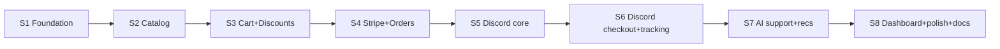

# 12 · MVP Roadmap — The Wedge

> **MVP thesis:** be the single best way to sell on Discord — with a *real*
> commerce core behind it and an AI that actually helps — and make it trivial to
> self-host. Narrow, deep, lovable. Everything else expands from here.

## Why this wedge

- **Underserved:** Shopify ignores Discord; existing bots are shallow (no real
  checkout, inventory truth, or records).
- **Buildable:** a small team can ship it in months.
- **On-ramp:** it naturally pulls in web, Telegram, WhatsApp, CRM, and the rest.
- **Community fit:** Discord-native sellers are technical, vocal, and open-source-friendly — perfect first contributors and users.

## In scope (MVP)

| Area | Included |
|---|---|
| Catalog | products, variants, digital & physical, categories, images |
| Inventory | stock per variant, reservations, low-stock flag |
| Cart & checkout | cart, discounts/coupons, checkout session |
| Payments | **Stripe** (intents + webhooks, idempotent), refunds |
| Orders | order lifecycle, status, returns (basic) |
| Discord | browse, search, cart, checkout link, order tracking, support tickets, reviews |
| AI | support assistant + product recommendations + memory (text) |
| Dashboard | overview, products, orders, customers, settings |
| Auth | users, orgs, roles (Owner/Admin/Support), API keys |
| Ops | Docker Compose, migrations, seed data, docs |

## Explicitly **out** of MVP (deferred)
Web storefront, Telegram, WhatsApp, marketplace/vendors, payouts, email/SMS
marketing, loyalty, shipping-carrier integrations, voice AI, forecasting, ML
fraud. (All in Phase 2/3.) Saying "no" here is the point.

## Sprint plan (≈ 8 two-week sprints)

| Sprint | Goal | Key deliverables |
|---|---|---|
| **S1** | Foundation | Monorepo, CI, Docker Compose, auth + RBAC, orgs, base models, migrations |
| **S2** | Catalog | Products/variants/categories/images APIs + dashboard CRUD + inventory basics |
| **S3** | Cart & discounts | Cart APIs, coupon/discount engine, pricing/tax scaffolding |
| **S4** | Payments & orders | Stripe intents + webhooks (idempotent), order lifecycle, refunds |
| **S5** | Discord core | Bot connection, browse/search, add-to-cart via canonical adapter |
| **S6** | Discord checkout | Checkout button/link, payment confirmation, order tracking DMs, tickets, reviews |
| **S7** | AI | Support assistant + recommendations + memory; tool calls (search, get_order, recommend) |
| **S8** | Dashboard & launch | Overview/orders/customers screens, polish, docs, demo store, **public launch** |

## Success metrics (what "MVP worked" means)

| Metric | Target signal |
|---|---|
| Time-to-first-sale (new self-hoster) | < 30 min from `docker compose up` |
| Real sellers running it | first cohort of live Discord stores |
| GitHub traction | stars, forks, first external contributors merged |
| Reliability | checkout success rate, webhook idempotency holds |
| AI usefulness | % support questions resolved without human |

## Risks & mitigations (MVP-specific)

| Risk | Mitigation |
|---|---|
| Discord API/policy changes | Channel adapter isolates platform specifics |
| Stripe webhook edge cases | Idempotency keys + dedupe + replay tests |
| Scope creep (the killer) | Hard "out of MVP" list above; review every addition against the wedge |
| AI hallucination in support | Grounded RAG + guardrails + human handoff |
| Onboarding friction | One-command setup + seed demo store + docs are a first-class deliverable |

## Definition of Done (MVP)

> A new user runs `docker compose up`, connects their Stripe + Discord, lists a
> product, and a customer buys it through Discord — payment captured, order
> recorded, stock decremented, tracking DM'd, AI answering support — all visible
> and manageable in the dashboard.

When that's true and a handful of real sellers are live, **we launch in public** and
begin Phase 2.

Next: [Phase 2 Roadmap](./13-phase-2-roadmap.md)
