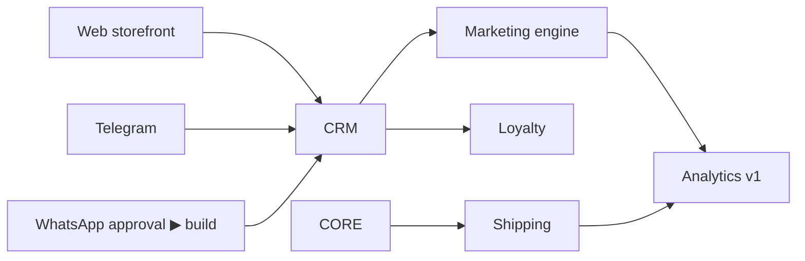

# 13 · Phase 2 Roadmap — Multi-Channel & Growth Engine

> **Goal:** turn the focused Discord wedge into a true omni-channel platform with
> one catalog everywhere, a real CRM, and a marketing engine — the moment DLC OS
> starts replacing multiple SaaS tools.

## Theme

Phase 1 proved the core and the model. Phase 2 proves the thesis: **one data model,
every channel**, plus the customer & marketing layer that turns one-time buyers into
relationships.

## Workstreams

### 1. Web storefront
A headless Next.js storefront on the same core: product pages, cart, checkout,
account, order history, reviews. Themeable; SEO-ready (SSR). Proves the core is
truly channel-agnostic.

### 2. Telegram commerce
Full parity with the Discord wedge via a new adapter: catalog, AI shopping
assistant, checkout flow, order management, support. Demonstrates "new channel = one
adapter."

### 3. WhatsApp commerce *(sequenced for approval lead time)*
- AI customer support, product browsing, order placement & tracking, automatic replies.
- Customer segmentation + **broadcast campaigns** + delivery updates.
- **Reality handled:** the WhatsApp Business API requires a verified business, Meta
  review, and template-message rules with per-message pricing. We start the approval
  process early and build template management + opt-in tracking into the design.

### 4. CRM
- Unified customer profiles with **identity resolution** across Discord/Telegram/WhatsApp/web.
- 360° timeline (orders + communications + notes), tags, **lifetime value**.
- **Segments** (rule-based, materialized), used by marketing & AI.
- **Loyalty** (points accounts + ledger).

### 5. Marketing engine
- **Email**, **SMS**, and **WhatsApp** campaigns to segments.
- Coupon campaigns, **referral program**, basic **affiliate** tracking.
- Scheduled & triggered (event-driven) campaigns via Celery.
- **AI marketing suggestions:** the assistant proposes segments, offers, and copy.

### 6. Shipping
- Carrier integration (e.g. EasyPost/Shippo): label generation, tracking, delivery
  estimates, status updates pushed to customers across channels.

### 7. Analytics v1
- Revenue, customer, product, channel dashboards.
- **AI-generated reports** ("How did last week go and why?").

### 8. AI upgrades
- **Voice** sessions (operator hands-free + customer voice support).
- Deeper automation (multi-step workflows with confirmation).

## Sequencing

WhatsApp's approval starts **in parallel at the beginning** of Phase 2 so the
review clock runs while web/Telegram/CRM are built.

## Success metrics

| Metric | Signal |
|---|---|
| Channels per active store | average > 2 |
| Cross-channel customers | % customers seen on >1 channel (identity resolution working) |
| Campaigns sent & attributed revenue | marketing engine driving sales |
| Tool replacement | users turning off other SaaS (CRM/email tools) |
| Retention/LTV | repeat-purchase rate rising via CRM + loyalty |

## Risks & mitigations

| Risk | Mitigation |
|---|---|
| WhatsApp approval delays | Start early; ship web/Telegram value regardless |
| Identity resolution false merges | Conservative matching + manual merge/split UI |
| Deliverability (email/SMS) | Reputable providers, opt-in, compliance (CAN-SPAM/TCPA) |
| Feature breadth dilutes quality | Each workstream has its own DoD; ship incrementally |

## Definition of Done (Phase 2)

> A business sells across web + Discord + Telegram (+ WhatsApp where approved) from
> one catalog, sees each customer as one person regardless of channel, and runs a
> segmented campaign that drives measurable, attributed revenue — replacing at
> least one other SaaS tool.

Next: [Phase 3 Roadmap](./14-phase-3-roadmap.md)
