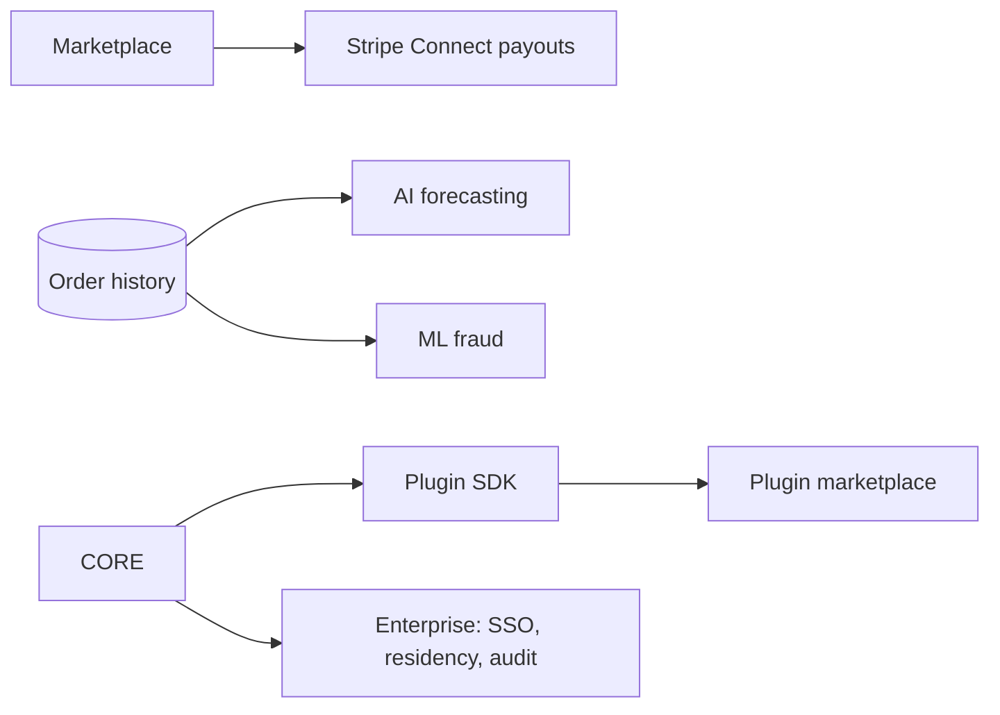

# 14 · Phase 3 Roadmap — The Operating System

> **Goal:** complete the operating system — a multi-vendor marketplace, real
> payouts, AI that forecasts and detects fraud (now that data exists), advanced
> analytics, an extensible plugin ecosystem, and enterprise readiness.

## Theme

By Phase 3, DLC OS is multi-channel with a real customer base and **accumulated
order history**. That history unlocks the AI features that were impossible earlier,
and the platform is mature enough to host *other people's* commerce (marketplace)
and *other people's* code (plugins).

## Workstreams

### 1. Multi-vendor marketplace
- Vendor **onboarding** & **verification** (KYC via provider).
- **Vendor dashboard** & analytics (their products, orders, earnings).
- **Commission system** (per-vendor/category rates) computed per order item.
- **Vendor reviews & rankings**.
- Marketplace channels (e.g. dedicated Discord vendor channels).

### 2. Payouts (done compliantly)
- **Stripe Connect** (and equivalents) so vendors get paid **without DLC OS ever
  custodying funds** — this sidesteps money-transmitter licensing, which is the
  single most important compliance decision in the whole platform.
- Payout scheduling, statements, reconciliation, holds for disputes.
- Additional payment rails for buyers: **PayPal, Square, crypto** (crypto with
  AML/KYC awareness).

### 3. AI forecasting & ML fraud *(data-dependent — correctly placed here)*
- **Inventory forecasting** over `inventory_movements` (demand prediction,
  reorder suggestions, seasonality).
- **ML fraud scoring** trained on the org's own order/chargeback history, layered
  on top of provider tools + rules.
- Both ship *because the data finally exists*, not before.

### 4. Advanced analytics & reporting
- Vendor analytics, cohort/retention, marketing attribution, conversion funnels.
- Scheduled **AI-generated reports** delivered to operators across channels.

### 5. Affiliate program at scale
- Affiliate onboarding, links, attribution, tiered commissions, payouts.

### 6. Plugin ecosystem
- **Plugin SDK**: declare hooks, routes, UI slots, and **AI tools** (`manifest.json`).
- **Plugin marketplace**: install/extend without forking. This is the long-term moat
  — a community-built ecosystem, like apps on an OS.

### 7. Enterprise readiness
- **SSO/SAML/OIDC**, SCIM provisioning.
- Advanced **audit**, data residency, multi-region, schema/DB-per-tenant option.
- SLAs, advanced RBAC, sandbox environments.
- Groundwork for **SOC 2**.

## Sequencing

## Success metrics

| Metric | Signal |
|---|---|
| Vendors onboarded & paid out | marketplace is live and trusted |
| Forecast accuracy | reduced stockouts / overstock for users |
| Fraud caught vs false positives | model earning its keep |
| Third-party plugins published | ecosystem forming |
| Enterprise deployments | larger orgs adopting/self-hosting |

## Risks & mitigations

| Risk | Mitigation |
|---|---|
| Money movement / licensing | **Never custody funds** — Stripe Connect/PayPal payouts only |
| KYC/AML obligations (vendors, crypto) | Use compliant providers; build verification in |
| Marketplace trust & quality | Verification, reviews, rankings, dispute handling |
| Plugin security | Sandboxing, permissions in manifest, review process |
| Enterprise complexity | Phase it; lead with SSO + audit + residency |

## Definition of Done (Phase 3)

> Independent vendors onboard, sell, and receive compliant payouts; the AI forecasts
> restocks and flags risky orders from real history; partners ship plugins through a
> marketplace; and an enterprise can deploy with SSO, audit, and data residency.
> DLC OS is now an operating system, not a store.

## Beyond Phase 3 (the horizon)
More channels (Instagram, iMessage, in-store/POS), localization & multi-currency at
depth, a hosted **DLC OS Cloud**, and an AI that runs more of the business
autonomously under human oversight. See [Monetization](./17-monetization-strategy.md).

Next: [Deployment Guide](./15-deployment-guide.md)
