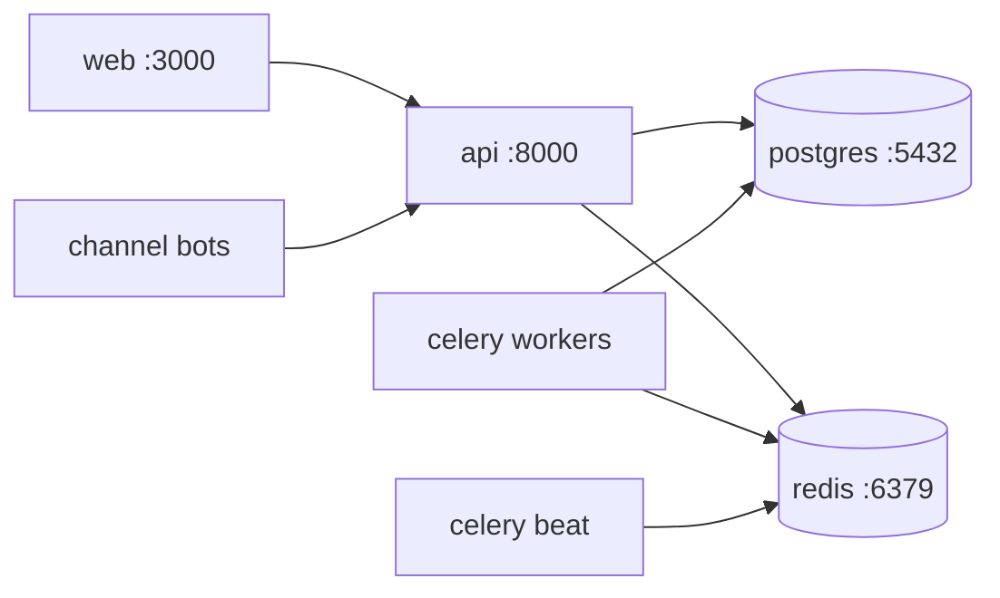
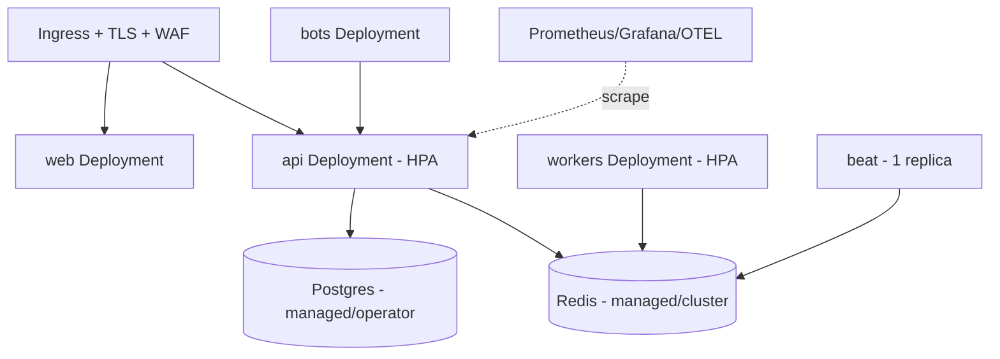
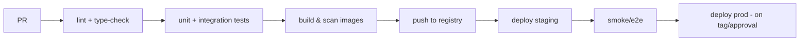

# 15 · Deployment Guide

> How to run DLC OS — from a laptop to a production Kubernetes cluster. Designed so
> the *same* artifacts run everywhere (12-factor).

> Reflects the **target** deployment model. As implementation lands, commands are
> validated against each release.

## Deployment options at a glance

| Option | For | Effort |
|---|---|---|
| **Docker Compose** | local dev, small self-host | one command |
| **Single VM** | small production | low |
| **Kubernetes (Helm)** | scalable production | medium |
| **DLC OS Cloud** (future) | zero-ops managed | none |

## 1. Local / self-host — Docker Compose

```bash
git clone https://github.com/danydenis560-beep/dlc-os.git
cd dlc-os
cp .env.example .env        # fill in keys
docker compose up           # api, web, workers, postgres, redis
```

Services started:



Then: run migrations & seed (handled by an entrypoint or `make setup`), open
`http://localhost:3000`, create the first org/owner.

## 2. Single VM (small production)

- Provision a VM (2–4 vCPU, 4–8 GB to start), install Docker.
- Use the production compose override (`infra/docker/compose.prod.yml`): pinned
  images, restart policies, no dev mounts.
- Put **Caddy/Nginx** (or Cloudflare) in front for TLS + WAF.
- Use **managed Postgres & Redis** if possible (backups, failover) or run with
  volumes + scheduled backups.
- Set real secrets via env/secret file (never in the image).

## 3. Kubernetes (scalable production)

Helm charts live in `infra/k8s/`.



- **Stateless** api/web/workers scale horizontally (HPA on CPU/RPS/queue depth).
- **Stateful** Postgres/Redis via managed services or operators; PVCs + backups.
- **Secrets** via Kubernetes Secrets / external secret manager (Vault, cloud KMS).
- **Object storage/CDN** for media & exports.
- **Beat** runs as a single replica (one scheduler).

## CI/CD

GitHub Actions pipeline (`.github/workflows/`):



- Lint (ruff/eslint), type-check (mypy/tsc), tests (pytest/vitest), image build +
  vulnerability scan + SBOM, deploy to staging, smoke tests, gated prod deploy on
  release tags. Migrations run as a pre-deploy job.

## Configuration

All via environment variables (see [`.env.example`](../.env.example)). Nothing
business-specific is baked into images. Per-environment values come from the
orchestrator's secret/config store.

## Database migrations

- **Alembic** migrations are versioned and reversible.
- Run as an init/job step before app rollout.
- Forward-compatible (expand → migrate → contract) for zero-downtime deploys.

## Observability

- **Logs:** structured JSON, shipped to your stack (Loki/ELK/cloud).
- **Metrics:** Prometheus (request rates, latencies, queue depth, payment success).
- **Traces:** OpenTelemetry across api → workers → providers.
- **Errors:** Sentry. **Dashboards/alerts:** Grafana. Configs in `infra/observability/`.

## Backups & DR

- Automated Postgres backups (PITR where possible), tested restores.
- Redis is cache/queue — treat as ephemeral except durable queues; design jobs to be replayable.
- Object storage versioning for media.
- Documented RPO/RTO targets per deployment tier.

## Scaling checklist

| Symptom | Action |
|---|---|
| High API latency | add api replicas; add read replicas; cache |
| Slow background work | add Celery workers; split queues by priority |
| DB hotspots | indexes (see [schema](./05-database-schema.md)); partition large tables |
| LLM cost/latency | model routing, caching, batching, local LLM |
| Media bandwidth | CDN in front of object storage |

## Hardening checklist (pre-prod)

- [ ] Real secrets in a secret manager; none in images/repo
- [ ] TLS everywhere; security headers; CORS locked
- [ ] Rate limiting + WAF enabled
- [ ] Backups configured **and a restore tested**
- [ ] Monitoring + alerting live
- [ ] Webhook signatures verified; idempotency on
- [ ] RBAC reviewed; MFA enforced for admins
- [ ] See full [Security Architecture](./09-security-architecture.md)

Next: [Open-Source Growth Strategy](./16-open-source-growth-strategy.md)
