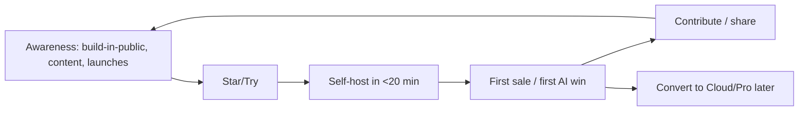

# 16 · Open-Source Growth Strategy

> How DLC OS becomes one of the most popular open-source commerce platforms in the
> world. Popularity is **earned** — by solving one painful problem brilliantly,
> making contribution joyful, and compounding community.

## The core truth

> Open-source projects don't get popular by having the most features. They get
> popular by solving **one painful problem better than anything else**, with great
> docs and DX, then expanding. A 12-module mega-repo with a weak core dies; a
> focused, lovable wedge with a bold vision thrives.

So our growth strategy and our [roadmap](./11-development-roadmap.md) are the same
shape: **nail the wedge, then widen.**

## Pillars

### 1. A lovable wedge (the product *is* the marketing)
The fastest growth engine is a tool people can't stop talking about. "Sell on
Discord with real checkout + AI, self-hosted in 20 minutes" is **demoable,
screenshot-able, and shareable**. We obsess over time-to-first-sale.

### 2. World-class DX & docs
- **One-command setup** (`docker compose up`) — friction is the enemy.
- A demo/seed store so people see value in minutes.
- Docs as a first-class deliverable (this very `docs/` tree), tutorials, videos.
- Clean APIs + generated SDKs so building on DLC OS is a pleasure.

### 3. Build in public
- Public roadmap, changelog, and RFCs.
- "Building in public" updates (dev logs, demos) on X/YouTube/Discord.
- Transparent metrics and milestones — momentum attracts momentum.

### 4. Make contributing joyful
- Curated `good first issue` / `help wanted`.
- Fast, kind reviews; clear [CONTRIBUTING](../CONTRIBUTING.md); ADRs so reasoning is visible.
- Recognize contributors (all-contributors, shout-outs, swag, maintainer paths).
- Mentorship; pair-programming office hours.

### 5. Community where the users are
Fittingly, our community lives on the channels we serve: an active **Discord** for
support, help, and roadmap; **GitHub Discussions** for proposals; meetups/streams.

### 6. Content & education
Comparison guides, "how we built X," channel-commerce playbooks, SEO-friendly docs.
Teach people to sell on Discord/Telegram/WhatsApp — and DLC OS is the natural tool.

### 7. Ecosystem & integrations
Plugins, templates, and integrations multiply reach. Every plugin author becomes a
promoter. The plugin marketplace (Phase 3) is both product and growth loop.

### 8. Strategic distribution
- Launch moments: Product Hunt, Hacker News ("Show HN"), relevant subreddits, dev newsletters.
- Awesome-lists, comparison pages, and OSS directories.
- Partnerships with creator/community tooling and agencies.

## Growth funnel

The loop: try → succeed fast → tell others / contribute → more try. Every step is
optimized for the next.

## Metrics that matter (and vanity we ignore)

| Track | Why |
|---|---|
| ⭐ Stars & trend | awareness proxy (necessary, not sufficient) |
| Self-host activations / time-to-first-sale | **real** value delivery |
| Active deployments (opt-in telemetry) | retention |
| Contributors (new + returning), PR merge time | community health |
| Discord activity, issue response time | support quality |
| Plugins published | ecosystem |

We avoid optimizing stars for their own sake; **activation and contribution** are the
north stars.

## Maintainer & governance health

- Clear ownership ([CODEOWNERS](../.github/CODEOWNERS)), transparent decisions (ADRs/RFCs).
- A path from contributor → maintainer.
- Funding maintainers (GitHub Sponsors / Open Collective) so the project is sustainable — see [Monetization](./17-monetization-strategy.md).
- Avoid burnout: triage rotation, automation, "no" as a feature.

## 12-month narrative arc

1. **Launch the wedge** (MVP) with a killer demo and docs → first stars & sellers.
2. **Build in public** through Phase 2 → channels + CRM + marketing land → "it
   replaced 3 tools" stories.
3. **Open the ecosystem** (plugins) and marketplace in Phase 3 → contributors and
   integrations compound → DLC OS becomes a category reference.

Next: [Monetization Strategy](./17-monetization-strategy.md)
