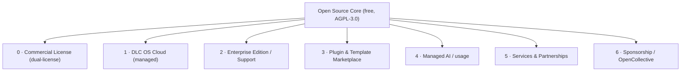
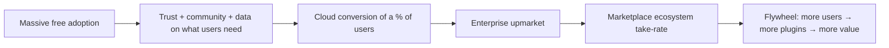

# 17 · Monetization Strategy

> How DLC OS funds its development and becomes a sustainable (potentially
> billion-dollar) company **without ever closing the core**. The open-source core
> is permanently free under the **AGPL-3.0**; revenue comes from a commercial
> license, convenience, scale, and ecosystem.

## Principle: open core, honest boundaries

- The **core is free forever** (AGPL-3.0). Self-host the whole platform at no cost.
- We monetize a **commercial license** (for orgs that can't adopt the AGPL),
  **convenience (managed cloud)**, **scale & enterprise needs**, and the
  **ecosystem (marketplace)** — never by paywalling basic commerce.
- The line is drawn so that *the people who can self-host happily do, and the people
  who'd rather pay to not operate infrastructure happily pay.* Both grow the project.

## Revenue streams

### 0. Commercial license (the dual-license)
DLC OS is offered under the **AGPL-3.0** *and* a paid **commercial license**. Companies
that can't accept the AGPL's network-copyleft — because they embed DLC OS in a closed
product, or internal policy forbids AGPL — buy a commercial license instead. Same code,
different terms: a clean, well-trodden funnel (Cal.com, Grafana, GitLab) that turns the
AGPL's main "objection" into revenue.

### 1. DLC OS Cloud (primary engine)
Fully-managed hosting: zero-ops, autoscaling, backups, monitoring, updates,
one-click channels. Tiered by usage (orders/GMV, channels, AI usage, seats).
This is the classic open-source SaaS model (GitLab, Supabase, Cal.com): most
revenue, lowest friction for non-technical users.

### 2. Enterprise Edition & support
An **open-core** commercial layer for large orgs — *added value, never core
removed*: SSO/SAML/SCIM, advanced audit & compliance, data residency/multi-region,
priority SLAs, dedicated support, security reviews. Sold as license + support.

### 3. Plugin & template marketplace
A marketplace for third-party plugins, themes, and channel/integration packs. DLC OS
takes a **revenue share**. Aligns incentives: developers earn, users get
capability, platform earns — and the ecosystem is a moat. (Phase 3.)

### 4. Managed AI / usage
Optional managed AI: bring-your-own-key is always free; a convenient metered AI
service (hosted models, memory, voice) for those who don't want to manage providers.
Transparent pass-through + margin; local-LLM stays free.

### 5. Services & partnerships
Migration help, implementation partners/agencies (certified), and referral
partnerships (payments, shipping, comms providers). A partner network also extends
distribution.

### 6. Sponsorship
GitHub Sponsors / Open Collective for individuals and companies that depend on DLC OS
— funds maintainers and keeps the project healthy from day one.

## Why AGPL-3.0 + a commercial license (not MIT or BSL)?

DLC OS is **dual-licensed**: the full platform is open source under the **AGPL-3.0**,
and a **commercial license** is available for organizations that can't or won't comply
with the AGPL's network-copyleft. This is the modern "commercial open source" structure
used by Cal.com, Grafana, and GitLab.

| Option | Pro | Con | Our stance |
|---|---|---|---|
| **AGPL-3.0 core** (chosen) | Fully OSI-open & free to self-host; network-copyleft stops a cloud giant from running a closed hosted clone; enables a commercial dual-license | Some enterprises can't ship AGPL code | **Chosen** — that "con" is a *revenue funnel*: those orgs buy the commercial license |
| MIT / Apache-2.0 | Max adoption, least friction | Gives the cloud moat away — anyone can host a closed fork | Too permissive to sustain a platform business |
| **BSL / SSPL (source-available)** | Blocks cloud resellers | Not OSI "open source"; community backlash | Avoid — never bait-and-switch the community |

To offer both licenses, contributions are accepted under a lightweight **CLA**
(see [CONTRIBUTING](../CONTRIBUTING.md)); your contribution always remains available to
everyone under the AGPL. The AGPL keeps the core **genuinely open and free to
self-host forever**, while the commercial license + Cloud + enterprise + marketplace
fund development. This decision is documented as an ADR and is revisitable.

## Pricing philosophy
- **Generous free tier** (self-host = everything; cloud free tier for small sellers).
- **Usage-aligned** (pay as you grow: GMV/orders/AI/seats) so cost tracks value.
- **No dark patterns**, transparent pricing, easy export (anti-lock-in builds trust → growth).

## Illustrative model (directional)

| Stream | Who pays | Pricing shape |
|---|---|---|
| Commercial license | orgs that can't ship AGPL | annual per-deployment license |
| Cloud Starter | small sellers | low flat + usage |
| Cloud Growth | scaling businesses | tiered by GMV/seats/AI |
| Enterprise | large orgs | annual license + support |
| Marketplace | plugin buyers/sellers | 15–30% rev share |
| Managed AI | convenience users | metered pass-through + margin |

## Path to a large business

The same playbook that built large open-source companies: **win developers and
SMBs with a free, lovable core; convert a slice to managed/enterprise; let the
ecosystem compound.** A platform that touches GMV across millions of sellers has a
very large revenue ceiling.

Next: [Investor Pitch](./18-investor-pitch.md)
