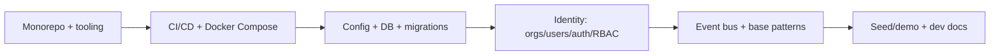

# 20 · Implementation Plan

> The bridge from blueprint to running software: how the pieces come together, in
> what order, with what definition of done — concrete enough to start building.

## Operating model

- **Modular monolith first** (one FastAPI app, clean module boundaries) for
  velocity; extract services later (see [Architecture](./04-architecture.md)).
- **Vertical slices:** each feature ships end-to-end (DB → API → UI/bot → tests →
  docs), not layer-by-layer. Always demoable.
- **Trunk-based + CI** from commit one. Tests and docs are part of "done."

## Phase 0 — Foundation (build order)

| Step | Deliverable | Done when |
|---|---|---|
| Monorepo & tooling | pnpm + Python workspaces, lint/format/type configs | `make setup` works |
| CI/CD | GitHub Actions: lint, type, test, build | green on PR |
| Local stack | `docker compose up` → api/web/workers/pg/redis | services boot |
| Data layer | async SQLAlchemy + Alembic + base models | first migration runs |
| Identity & RBAC | orgs, users, JWT auth, roles, API keys | login + protected route |
| Foundations | event bus, error envelope, pagination, rate limit | reused by modules |

## Phase 1 — MVP build order (vertical slices)

Mirrors the [MVP Roadmap](./12-mvp-roadmap.md) sprints; each row is a shippable slice.

| Slice | DB | API | Surface | Tests |
|---|---|---|---|---|
| Catalog | products, variants, categories, images | CRUD + search | dashboard product mgmt | unit+integration |
| Inventory | inventory_items, movements | stock endpoints | stock UI + low-stock flag | unit |
| Cart & discounts | carts, cart_items, discounts | cart + coupon APIs | cart logic | unit |
| Payments | payments | Stripe intents + **webhook (idempotent)** | — | webhook replay tests |
| Orders | orders, order_items, refunds, returns | lifecycle + refund | dashboard orders | integration |
| Discord core | channel sessions | canonical AddToCart/Checkout via adapter | bot browse/search/cart | adapter tests |
| Discord checkout | — | checkout link + confirm | pay → order → tracking DM, tickets, reviews | e2e happy path |
| AI support+recs | ai_conversations, ai_messages, ai_memories | `/ai/chat` + tools | assistant in dashboard & Discord | tool + guardrail tests |
| Dashboard | — | — | overview, customers, settings, polish | UI tests |

**MVP exit criteria** = the [MVP Definition of Done](./12-mvp-roadmap.md#definition-of-done-mvp) + first real sellers live → **public launch**.

## Engineering standards (from day one)
- **Tests:** unit (services), integration (API + DB), e2e (critical flows: checkout,
  Discord buy, refund). Payment webhooks have replay/idempotency tests.
- **Types:** mypy (Python), strict TS. **Lint:** ruff, eslint. **Format:** ruff, prettier.
- **Migrations:** reversible, expand→contract for zero-downtime.
- **Docs:** every module updates its spec in `docs/modules/` + API docs as it lands.
- **Security:** input validation, tenant scoping, idempotency, secrets hygiene — see [Security](./09-security-architecture.md).
- **Observability:** structured logs + traces + metrics from the first service.

## Definition of Done (per feature)
A feature is done when: it works end-to-end across the relevant surface(s); it's
tenant-scoped & permissioned; it has tests at the right levels; it's observable; its
docs/spec are updated; and it's behind config/flags where risky. "Works on my
machine" is not done.

## Team shape (ideal, scalable down to a few people)
| Role | Focus |
|---|---|
| Backend (FastAPI) | core domain, payments, channels |
| Frontend (Next.js) | dashboard & storefront from the design system |
| AI engineer | orchestrator, memory, tools, guardrails |
| DevOps/SRE | CI/CD, Docker/K8s, observability |
| DevRel/community | docs, onboarding, Discord, content |

A 2–3 person team can ship the MVP by sequencing slices; the open-source community
accelerates everything after launch.

## Risk register (top items)
| Risk | Likelihood | Impact | Mitigation |
|---|---|---|---|
| Scope creep beyond the wedge | High | High | Hard MVP "out" list; review every add vs the wedge |
| Payment/webhook correctness | Med | High | Idempotency + replay tests + provider tooling |
| Platform API/policy change | Med | Med | Adapter abstraction; multi-channel |
| WhatsApp approval lead time | High | Med | Start early (Phase 2); don't block other value |
| Money-movement compliance | Med | High | Stripe Connect; **never custody funds**; counsel review |
| AI safety (wrong actions) | Med | High | RBAC + confirmations + limits + audit |
| Maintainer burnout | Med | High | Automation, triage rotation, funding, "no" as a feature |

## How to start (literally next steps)
1. Create `dlc-os/dlc-os`, push this blueprint (it already includes README + community files).
2. Scaffold the monorepo (`apps/`, `packages/`, `infra/`) + CI + Docker Compose (Phase 0).
3. Implement Identity + RBAC, then the Catalog slice.
4. Open `good first issue`s from the module specs; announce the build-in-public start.
5. Follow the MVP slices to first paid Discord sale → launch.

This document, the [roadmaps](./11-development-roadmap.md), and the
[module specs](./modules/) are sufficient to begin implementation immediately.

— End of the core blueprint. See the [module specifications](./modules/) for
feature-level detail on all twelve modules.
