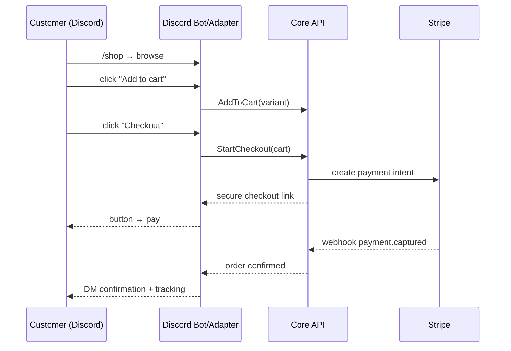

# Module 03 · Discord Commerce

> The MVP wedge — a *real* store inside Discord: proper checkout, inventory truth,
> order records, and AI support. Where DLC OS wins first.

**Phase:** MVP (core), with vendor/marketplace & affiliate features in Phase 3.
**Related:** [MVP Roadmap](../12-mvp-roadmap.md) · [Architecture (channel adapters)](../04-architecture.md)

## Features

| Feature | Notes | Phase |
|---|---|---|
| Product browsing | Embeds + components (buttons/menus) | MVP |
| Product search | Slash command / query | MVP |
| Shopping cart | Canonical cart via adapter | MVP |
| Checkout | Secure Stripe checkout link/button | MVP |
| Order tracking | Status + tracking via DM/command | MVP |
| Ticket support | Support threads/tickets | MVP |
| AI support assistant | Grounded answers + handoff | MVP |
| Review system | Post-purchase reviews | MVP→P2 |
| Vendor accounts | Vendor roles & product ownership | P3 |
| Marketplace channels | Per-vendor channels | P3 |
| Automated notifications | Order/stock/delivery DMs | MVP→P2 |
| Referral program | Referral codes & rewards | P2 |
| Affiliate program | Affiliate links & attribution | P3 |

## Architecture: thin adapter, real core
The Discord bot holds **no business logic**. It translates Discord interactions
(slash commands, button clicks) into **canonical commands** (`AddToCart`,
`StartCheckout`) sent to the Core API, and renders canonical responses as Discord
embeds/components.

## Why checkout is a link (not in-DM card entry)
Card data never touches the bot — checkout happens on a Stripe-hosted page, keeping
**PCI scope minimal** (see [Payments](./10-payments.md), [Security](../09-security-architecture.md)).

## Data model
Uses the core (`carts`, `orders`, …) + `customers.channel_identities.discord_id` for
identity, `communications` for message history, `ai_*` for support.

## Constraints handled
- **Discord API/policy & rate limits** → isolated in the adapter; retries/backoff.
- **Identity** → Discord user mapped to a single `customer` (cross-channel resolution).

## Operator UX
Connect a bot token in Settings → Channels; map categories/products to the storefront;
manage everything from the same dashboard as web orders.
