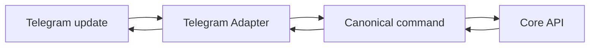

# Module 05 · Telegram Commerce

> A full shopping experience in Telegram — proof that "new channel = one adapter."

**Phase:** Phase 2.
**Related:** [Phase 2 Roadmap](../13-phase-2-roadmap.md) · [Architecture](../04-architecture.md)

## Features

| Feature | Notes | Phase |
|---|---|---|
| AI shopping assistant | Conversational discovery + recommendations | P2 |
| Product catalog | Inline keyboards, photos, web-app view | P2 |
| Checkout flow | Stripe link or Telegram payments | P2 |
| Customer support | AI + human handoff | P2 |
| Order management | Status, tracking, history | P2 |

## Why Telegram is a fast follow
Telegram's **Bot API** is developer-friendly (inline keyboards, web apps, optional
native payments). After the Discord adapter exists, Telegram reuses the same
canonical command/response layer — mostly a presentation layer.

## Architecture
Channel adapter normalizes Telegram updates → canonical commands; renders responses
as inline keyboards / Telegram Web App. No business logic in the adapter.

## Checkout options
1. **Stripe-hosted link** (consistent, minimal PCI scope) — default.
2. **Telegram native payments** (provider-backed) — optional for in-app smoothness.

## Data model
Core commerce + `customers.channel_identities.telegram_id`, `communications`, `ai_*`.

## Config
`TELEGRAM_BOT_TOKEN`. Webhook or long-poll supported.
