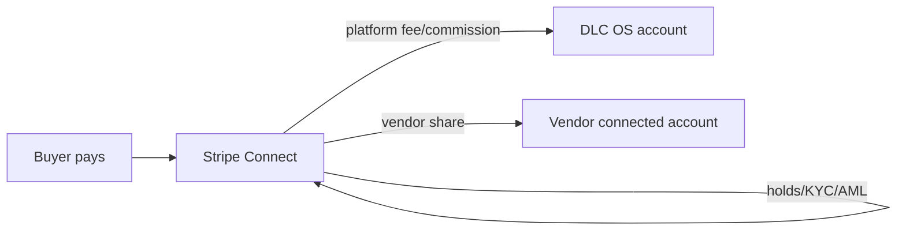

# Module 06 · Marketplace System

> Turn DLC OS into a multi-vendor marketplace — many sellers, one platform — with
> compliant payouts. The most regulation-sensitive module, designed accordingly.

**Phase:** Phase 3.
**Related:** [Phase 3 Roadmap](../14-phase-3-roadmap.md) · [Payments](./10-payments.md) · [Security](../09-security-architecture.md)

## Features

| Feature | Notes | Phase |
|---|---|---|
| Multi-vendor marketplace | Many vendors selling under one storefront/community | P3 |
| Vendor dashboard | Own products, orders, earnings | P3 |
| Vendor analytics | Sales, payouts, rankings | P3 |
| Vendor onboarding | Application + setup flow | P3 |
| Vendor verification | KYC via provider | P3 |
| Commission system | Per-vendor/category rates per order item | P3 |
| Payout system | **Stripe Connect** scheduled payouts | P3 |
| Vendor reviews | Buyer ratings of vendors | P3 |
| Vendor rankings | Performance-based ranking/visibility | P3 |

## The critical compliance decision
Paying out third-party vendors means **moving other people's money** — which is
**money transmission** and triggers licensing **unless** funds flow through a
licensed processor's marketplace product.

> **DLC OS never custodies funds.** Payouts run through **Stripe Connect** (or
> equivalent). The platform orchestrates; the processor holds and moves the money and
> handles vendor KYC. This single decision keeps the marketplace legal without a
> money-transmitter license.

## Data model
`vendors` (status, commission_rate, payout_account), `commissions` (per order_item),
`payouts`, `vendor_reviews`; `products.vendor_id`, `orders.vendor_id`,
`order_items.vendor_id`. See [Database Schema](../05-database-schema.md).

## Flows
- **Onboarding:** apply → verify (KYC) → connect payout account → list products.
- **Order split:** a multi-vendor order computes per-item commission; settlement &
  payouts run via Connect.
- **Trust & safety:** verification + reviews + rankings + dispute/hold handling.

## Key endpoints
`/vendors`, `/vendors/{id}/verify`, `/vendors/{id}/payouts`, `/payouts/run`,
`/commissions`. See [API Design](../06-api-design.md).

## Constraints handled
KYC/AML (provider), tax/reporting (e.g. 1099-style via processor), dispute
liability, and per-region rules — all leaned onto the payment processor by design.
