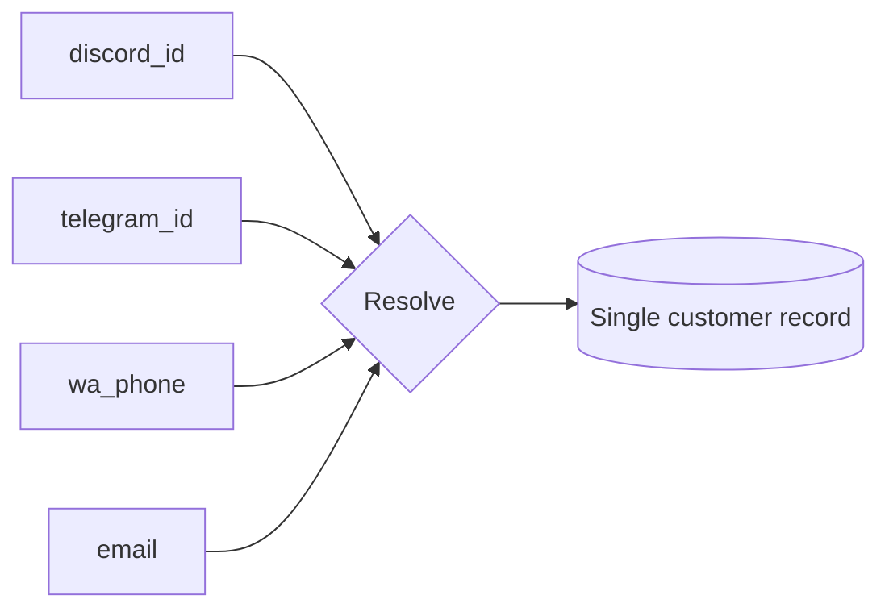

# Module 07 · CRM System

> One customer, every channel. The unified relationship layer that turns scattered
> buyers into a coherent, actionable customer base — and powers AI + marketing.

**Phase:** Phase 2 (basic customer records exist from MVP).
**Related:** [Marketing](./11-marketing.md) · [AI Architecture](../10-ai-architecture.md)

## Features

| Feature | Notes | Phase |
|---|---|---|
| Customer profiles | Unified across web/Discord/Telegram/WhatsApp | MVP→P2 |
| Customer history | Orders + communications + actions timeline | P2 |
| Notes | Operator/AI notes | P2 |
| Tags | Free-form labels | P2 |
| Customer lifetime value | Computed & cached `lifetime_value` | P2 |
| Segmentation | Rule-based, materialized audiences | P2 |
| Communication history | Every message, every channel, one timeline | P2 |
| Loyalty system | Points accounts + ledger | P2 |

## The hard part: identity resolution
The same human appears as a Discord ID, a Telegram ID, a WhatsApp number, and a web
email. CRM value depends on recognizing them as **one customer**.

`customers.channel_identities` (jsonb) holds known identities. Matching is
**conservative** (explicit signals: shared email/phone, account linking) to avoid
false merges, with a manual **merge/split** UI for operators.

## Data model
`customers`, `addresses`, `customer_notes`, `segments`/`customer_segments`,
`loyalty_accounts`/`loyalty_transactions`, `communications`. See [Schema](../05-database-schema.md).

## Segmentation
A segment stores a `rule` (jsonb: e.g. "LTV > $100 AND last_order < 60d AND
channel = discord") → materialized membership, recomputed on relevant events. Used
by [Marketing](./11-marketing.md) and the [AI](./01-ai-assistant.md).

## 360° customer view
Dashboard profile: identities, LTV, tags, segments, full order + communication
timeline, loyalty, and an AI summary/next-best-action. See [UI/UX](../08-ui-ux-system.md).

## Powers the rest of the OS
CRM is the substrate marketing targets, the AI personalizes from, and analytics
measures. Getting the unified profile right is what makes "operating system" true.
