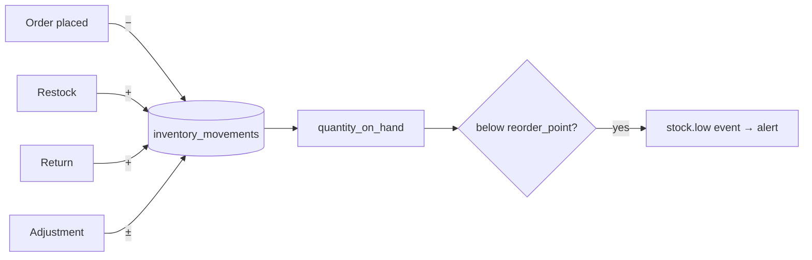

# Module 08 · Inventory Management

> Stock truth across products, warehouses, and channels — with an auditable movement
> ledger that later powers AI forecasting.

**Phase:** Core in MVP (stock + low-stock); warehouses & barcode in P2; forecasting in P3.
**Related:** [E-Commerce](./02-ecommerce.md) · [AI Architecture](../10-ai-architecture.md)

## Features

| Feature | Notes | Phase |
|---|---|---|
| Stock management | Per-variant on-hand & reserved | MVP |
| Warehouse management | Stock per location | P2 |
| Low-stock alerts | `reorder_point` thresholds → alerts | MVP |
| Inventory forecasting | Demand prediction over history | P3 (needs data) |
| Product movement tracking | Append-only `inventory_movements` ledger | MVP |
| Barcode support | Scan to receive/adjust/sell | P2 |

## Stock model
`inventory_items` track `quantity_on_hand` and `quantity_reserved` per
`(variant, warehouse)`. **Available = on_hand − reserved.** Checkout **reserves**
stock to prevent oversell; reservations release on order completion, cancel, or
expiry.

## The movement ledger (why it matters)
Every change is a row in `inventory_movements` (`type`, `delta`, `reason`,
`reference_id`). This gives an **auditable history** *and* the **time-series** the
[AI forecasting](./01-ai-assistant.md) (P3) needs. Forecasting is correctly deferred:
it's a data problem, useless until history accrues.

## Data model
`warehouses`, `inventory_items`, `inventory_movements`. See [Schema](../05-database-schema.md).

## Events
`stock.adjusted`, `stock.low` → consumed by alerts, marketing (back-in-stock),
analytics, and AI.

## Operator UX
Stock visible on product/variant screens; low-stock badge on Overview; AI brief
surfaces "3 SKUs low — reorder?" with one-click action. See [UI/UX](../08-ui-ux-system.md).
