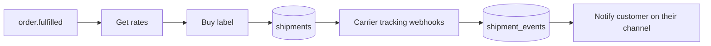

# Module 09 · Shipping System

> From "order placed" to "delivered" — labels, tracking, and proactive delivery
> updates across every channel.

**Phase:** Phase 2.
**Related:** [E-Commerce](./02-ecommerce.md) · [Phase 2 Roadmap](../13-phase-2-roadmap.md)

## Features

| Feature | Notes | Phase |
|---|---|---|
| Shipment creation | From an order/fulfilment | P2 |
| Tracking | Tracking number + status timeline | P2 |
| Delivery updates | Pushed to customer on their channel | P2 |
| Shipping providers | Carrier integration (multi-carrier) | P2 |
| Label generation | Buy & print labels | P2 |
| Estimated delivery dates | Surfaced at checkout & post-purchase | P2 |

## Architecture
Integrate via a **multi-carrier aggregator** (e.g. EasyPost/Shippo) so one
integration unlocks many carriers (USPS/UPS/FedEx/DHL…). A `carriers/` provider
layer mirrors the payments provider pattern — swappable, testable.

## Data model
`shipments` (carrier, tracking_number, label_url, status, estimated_delivery),
`shipment_events` (status timeline). See [Schema](../05-database-schema.md).

## Cross-channel delivery updates
Because shipping emits events and the CRM knows each customer's channel, a "shipped"
or "delivered" update reaches the customer where they bought — Discord DM, WhatsApp,
Telegram, or email — automatically.

## Config
`SHIPPING_PROVIDER_API_KEY`. Rates/labels/tracking via the provider; webhooks update
`shipment_events`.

## Events
`shipment.created`, `delivery.updated`, `delivery.completed` → notifications,
analytics, AI memory.
