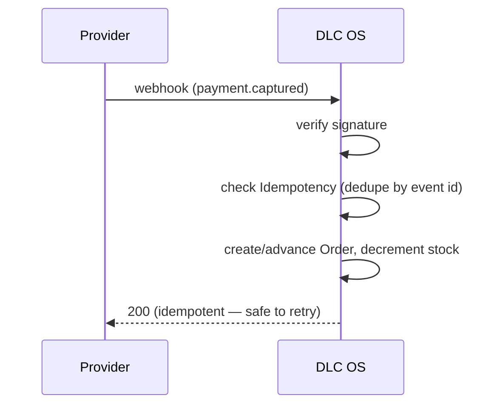

# Module 10 · Payment System

> Take money reliably and safely across many providers, with refunds, verification,
> and fraud defense — while keeping PCI scope and compliance burden minimal.

**Phase:** Stripe in MVP; PayPal/Square/crypto and advanced fraud in P2–P3.
**Related:** [Security](../09-security-architecture.md) · [Marketplace](./06-marketplace.md)

## Supported providers

| Provider | Status | Notes |
|---|---|---|
| **Stripe** | MVP | Default; hosted checkout, intents, webhooks, Connect (payouts), Radar (fraud) |
| **PayPal** | P2 | Wallet + cards |
| **Square** | P2 | Online + in-person |
| **Crypto** | P3 | Via a compliant processor (AML/KYC aware) |
| Cash App / Zelle | ⚠️ see note | **No real merchant/marketplace API** — supported only as *manual/offline* payment with operator verification, not automated capture |
| Bank transfer | P2 | Manual/ACH where supported |

> **Honesty note:** Cash App and Zelle are peer-to-peer and **don't offer merchant
> APIs** suitable for automated e-commerce capture. DLC OS models them as
> **manual/offline** payment methods (operator marks paid after verifying), rather
> than pretending an integration exists that doesn't.

## Features

| Feature | Notes | Phase |
|---|---|---|
| Refunds & partial refunds | Full/partial via provider | MVP |
| Payment verification | Webhook-confirmed, signature-verified | MVP |
| Fraud detection | Provider tools → rules → ML (layered) | MVP→P3 |

## Provider abstraction
A common `PaymentProvider` interface (`create_intent`, `capture`, `refund`,
`verify_webhook`) with implementations in `payments/providers/`. Adding a provider =
one module. Channels & checkout never touch provider specifics.

## Reliability: webhooks done right

All webhook handlers **verify signatures**, are **idempotent** (dedupe by event id),
and are **replay-tested**. Logged in `webhook_deliveries`.

## Minimizing PCI scope
Card data is **tokenized by the provider** on hosted pages — **DLC OS never stores
raw card numbers** (SAQ-A posture). Chat-channel checkouts use hosted links for the
same reason. See [Security](../09-security-architecture.md).

## Fraud detection (layered, honest sequencing)
1. **Provider-native** (Stripe Radar/PayPal) — MVP, network-scale signals.
2. **Rules** — velocity, geo/IP mismatch, disposable email, value thresholds — P2.
3. **ML scoring** — trained on the org's own history — **P3 (needs data)**.
4. **Operator review queue** — AI summarizes risk; human decides; feeds back.

## Data model
`payments` (provider, provider_ref, status, fraud_score, raw), `refunds`,
`webhook_deliveries`; marketplace adds Connect refs in `vendors.payout_account`.

## Key endpoints
`/payments/intents`, `/payments/{id}/capture`, `/orders/{id}/refunds`,
`/webhooks/{provider}`. See [API Design](../06-api-design.md).
