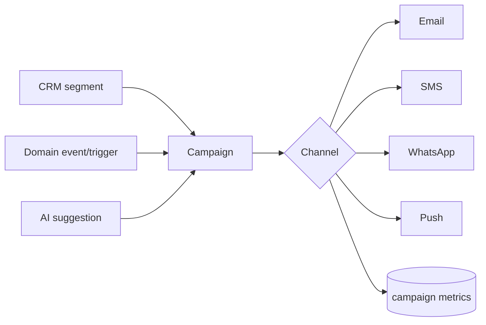

# Module 11 · Marketing System

> Reach customers where they are, with the right message — across email, SMS,
> WhatsApp, and push — powered by CRM segments and AI suggestions.

**Phase:** Phase 2 (referrals early; affiliates at scale in P3).
**Related:** [CRM](./07-crm.md) · [AI Assistant](./01-ai-assistant.md) · [WhatsApp](./04-whatsapp-commerce.md)

## Features

| Feature | Notes | Phase |
|---|---|---|
| Email marketing | Campaigns to segments | P2 |
| SMS marketing | Provider-backed (e.g. Twilio) | P2 |
| WhatsApp marketing | Template + opt-in (see WhatsApp module) | P2 |
| Push notifications | Web/app push | P2 |
| Referral campaigns | Codes, rewards, attribution | P2 |
| Affiliate campaigns | Links, tiers, payouts | P3 |
| Coupon campaigns | Tie discounts to campaigns | P2 |
| AI marketing recommendations | Segments, offers, copy | P2 |

## How it works
Marketing sits on top of **[CRM segments](./07-crm.md)** and the **event bus**:
campaigns target a segment, render content, and send via the right channel provider —
scheduled or **event-triggered** (e.g. `back-in-stock`, `cart.abandoned`,
`order.delivered`). Sending runs on **Celery workers**.

## AI marketing suggestions
The assistant proposes **who** (segment), **what** (offer/coupon), and **words**
(copy) based on behavior and performance — e.g. "Win back 142 lapsed Discord buyers
of Category X with a 15% code; here's the message." Operator approves & sends.

## Data model
`campaigns` (type, segment_id, content, status, scheduled_at, metrics),
`referrals`, `affiliates`/`affiliate_clicks`/`affiliate_conversions`, plus
`discounts` for coupon campaigns. See [Schema](../05-database-schema.md).

## Compliance (built in, not optional)
- **Email:** CAN-SPAM/GDPR — unsubscribe, sender identity, consent.
- **SMS:** TCPA/opt-in, STOP handling.
- **WhatsApp:** opt-in + approved templates + care-window (see [WhatsApp](./04-whatsapp-commerce.md)).
- Consent & suppression lists are first-class; the AI respects them.

## Key endpoints
`/campaigns`, `/campaigns/{id}/send`, `/referrals`, `/affiliates`. See [API Design](../06-api-design.md).
