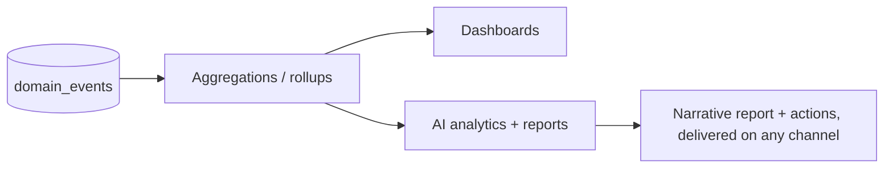

# Module 12 · Analytics

> Know what's happening and why — revenue, customers, products, vendors, channels —
> with AI that turns data into plain-language reports and next steps.

**Phase:** Analytics v1 in Phase 2; advanced & AI reports deepen in Phase 3.
**Related:** [AI Architecture](../10-ai-architecture.md) · [Architecture (events)](../04-architecture.md)

## Features

| Feature | Notes | Phase |
|---|---|---|
| Revenue analytics | Sales, AOV, growth, by channel/period | P2 |
| Customer analytics | New vs returning, cohorts, retention, LTV | P2 |
| Product analytics | Best/worst sellers, conversion, stock turns | P2 |
| Vendor analytics | Per-vendor sales, payouts, rankings | P3 |
| Conversion analytics | Funnels by channel | P2 |
| Marketing analytics | Campaign performance, attribution | P2 |
| AI-generated reports | Narrative summaries + recommendations | P2 |

## Architecture: events in, insight out
Modules emit **domain events** (`order.placed`, `checkout.completed`,
`campaign.sent`, …). Analytics consumes them into query-optimized aggregates, so
dashboards are fast and the transactional core stays clean.

At small scale this runs in Postgres (materialized views / rollup tables); at large
scale, rollups move to a dedicated analytical store — without changing the event
contract.

## AI reporting & natural-language analytics
The [AI](./01-ai-assistant.md) calls `get_analytics`/`generate_report` tools to
answer questions ("How did last week go and why?") and to **push scheduled reports**
to operators across channels — with recommended actions, not just numbers.

## Data model
Reads from `domain_events` + core tables into rollups. Reports persisted for history.
See [Schema](../05-database-schema.md).

## Dashboards
Overview KPIs + drill-downs per area (see [UI/UX](../08-ui-ux-system.md)). Every
chart is also a question the AI can answer in words.

## Privacy
Analytics respects tenant isolation and PII rules; aggregates avoid exposing
individuals inappropriately. See [Security](../09-security-architecture.md).
